Aolynk CB304n Cable 网桥

用户手册

Copyright © 2014 杭州华三通信技术有限公司及其许可者 版权所有，保留一切权利。

未经本公司书面许可，任何单位和个人不得擅自摘抄、复制本书内容的部分或全部，并不得以任何形式传播。

H3C、 、H3CS、H3CIE、H3CNE、Aolynk、 、H3Care、 、IRF、NetPilot、Netflow、SecEngine、SecPath、SecCenter、SecBlade、Comware、ITCMM、HUASAN、华三均为杭州华三通信技术有限公司的商标。对于本手册中出现的其它公司的商标、产品标识及商品名称，由各自权利人拥有。

由于产品版本升级或其他原因，本手册内容有可能变更。H3C保留在没有任何通知或者提示的情况下对本手册的内容进行修改的权利。本手册仅作为使用指导，H3C尽全力在本手册中提供准确的信息，但是 H3C 并不确保手册内容完全没有错误，本手册中的所有陈述、信息和建议也不构成任何明示或暗示的担保。

## 前 言

《Aolynk CB304n Cable 网桥 用户手册》将会详细地指导您如何通过 Web 设置页面对设备进行本地管理。

前言部分包含如下内容：

• 读者对象

• 本书约定

资料获取方式

• 技术支持

资料意见反馈

## 读者对象

本手册主要适用于如下工程师：

• 网络规划人员

• 现场技术支持与维护人员

• 负责网络配置和维护的网络管理员

## 本书约定

## 1. 命令行格式约定

<table><tr><td rowspan=1 colspan=1>格式</td><td rowspan=1 colspan=1>意义</td></tr><tr><td rowspan=1 colspan=1>粗体</td><td rowspan=1 colspan=1>命令行关键字（命令中保持不变、必须照输的部分）采用加粗字体表示。</td></tr><tr><td rowspan=1 colspan=1>斜体</td><td rowspan=1 colspan=1>命令行参数（命令中必须由实际值进行替代的部分）采用斜体表示。</td></tr><tr><td rowspan=1 colspan=1>[]</td><td rowspan=1 colspan=1>表示用“[]”括起来的部分在命令配置时是可选的。</td></tr><tr><td rowspan=1 colspan=1>{x|y|...}</td><td rowspan=1 colspan=1>表示从多个选项中仅选取一个。</td></tr><tr><td rowspan=1 colspan=1>[x|y|...]</td><td rowspan=1 colspan=1>表示从多个选项中选取一个或者不选。</td></tr><tr><td rowspan=1 colspan=1>{x|y|...}*</td><td rowspan=1 colspan=1>表示从多个选项中至少选取一个。</td></tr><tr><td rowspan=1 colspan=1>[x|y|.….]*</td><td rowspan=1 colspan=1>表示从多个选项中选取一个、多个或者不选。</td></tr><tr><td rowspan=1 colspan=1>&amp;&lt;1-n&gt;</td><td rowspan=1 colspan=1>表示符号&amp;前面的参数可以重复输入1~n次。</td></tr><tr><td rowspan=1 colspan=1>#</td><td rowspan=1 colspan=1>由“#”号开始的行表示为注释行。</td></tr></table>

## 2. 图形界面格式约定

<table><tr><td rowspan=1 colspan=1>格式</td><td rowspan=1 colspan=1>意义</td></tr><tr><td rowspan=1 colspan=1>&lt;&gt;</td><td rowspan=1 colspan=1>带尖括号“&lt;&gt;”表示按钮名，如“单击&lt;确定&gt;按钮”。</td></tr><tr><td rowspan=1 colspan=1>[]</td><td rowspan=1 colspan=1>带方括号“[]”表示窗口名、菜单名和数据表，如“弹出[新建用户]窗口”。</td></tr><tr><td rowspan=1 colspan=1>1</td><td rowspan=1 colspan=1>多级菜单用“I”隔开。如[文件/新建/文件夹]多级菜单表示[文件]菜单下的[新建]子菜单下的[文件夹]菜单项。</td></tr></table>

## 3. 各类标志

本书还采用各种醒目标志来表示在操作过程中应该特别注意的地方，这些标志的意义如下：

<table><tr><td rowspan=1 colspan=1>  注意</td><td rowspan=1 colspan=1>提醒操作中应注意的事项，不当的操作可能会导致数据丢失或者设备损坏。</td></tr><tr><td rowspan=1 colspan=1> 提示</td><td rowspan=1 colspan=1>为确保设备配置成功或者正常工作而需要特别关注的操作或信息。</td></tr><tr><td rowspan=1 colspan=1>  说明</td><td rowspan=1 colspan=1>对操作内容的描述进行必要的补充和说明。</td></tr></table>

## 资料获取方式

您可以通过H3C网站（www.h3c.com.cn）获取最新的产品资料：

H3C网站与产品资料相关的主要栏目介绍如下：

[服务支持/文档中心]：可以获取硬件安装类、软件升级类、配置类或维护类等产品资料。

[产品技术]：可以获取产品介绍和技术介绍的文档，包括产品相关介绍、技术介绍、技术白皮书等。

[解决方案]：可以获取解决方案类资料。

[服务支持/软件下载]：可以获取与软件版本配套的资料。

## 技术支持

用户支持邮箱：service@h3c.com

技术支持热线电话：400-810-0504（手机、固话均可拨打）

网址：http://www.h3c.com.cn

## 资料意见反馈

如果您在使用过程中发现产品资料的任何问题，可以通过以下方式反馈：

E-mail：info@h3c.com

感谢您的反馈，让我们做得更好！

## 目 录

1 您想了解什么？ ································································································································· 1-1  
2 产品概述 ············································································································································ 2-1  
2.1 产品简介 ············································································································································ 2-1  
2.2 产品特点 ············································································································································ 2-1  
3 登录设备Web页面  
3.1 建立网络连接····································································································································· 3-1  
3.1.2 无线方式 ································································································································· 3-2  
3.1.3 取消代理服务器 ······················································································································ 3-3  
3.2 登录设备Web页面 ····························································································································· 3-4  
3.3 熟悉Web设置页面 ····························································································································· 3-5  
3.3.1 Web设置页面概述··················································································································· 3-5  
3.3.2 退出 ········································································································································ 3-6  
4 设备常用功能管理  
4.1 网络 ····  
4.1.1 LAN侧地址配置······················································································································· 4-1  
4.1.2 无线配置 ································································································································· 4-2  
4.2 安全 ··················· ····························································································································· 4-5  
4.2.1 广域网访问控制 ······················································································································ 4-5  
4.2.2 防火墙 ····································································································································· 4-5  
4.2.4 IP过滤 ····································································································································· 4-7  
4.3 应用 ··················································································································································· 4-7  
4.3.1 DDNS配置 ······························································································································4-7  
4.3.2 高级NAT配置 ·························································································································· 4-8  
4.3.3 upnp配置 ······························································································································4-10  
4.3.4 IGMP配置 ····························································································································· 4-10  
4.4 管理 ················································································································································· 4-11  
4.4.1 用户管理 ······························································································································· 4-11  
4.4.2 设备管理 ······························································································································· 4-12  
4.5 状态 ················  
4.5.1 设备信息 ······························································································································· 4-13  
4.5.2 网络侧信息···························································································································· 4-14  
4.5.3 用户侧信息···························································································································· 4-14  
4.6 帮助 ················································································································································· 4-15  
5 附录 – 故障排除 ································································································································· 5-1

## 您想了解什么？

<table><tr><td rowspan=1 colspan=1>如果您想</td><td rowspan=1 colspan=1>您可以查看</td></tr><tr><td rowspan=1 colspan=1>初识设备的大致形态、熟悉设备面板上的接口、指示灯及设备的主要特点</td><td rowspan=1 colspan=1>“产品概述”</td></tr><tr><td rowspan=1 colspan=1>通过有线或无线的方式建立网络连接，登陆设备Web页面</td><td rowspan=1 colspan=1>“登录设备Web页面”</td></tr><tr><td rowspan=1 colspan=1>通过Web设置页面来对设备进行配置和管理，包括：网络、安全、应用、管理和帮助</td><td rowspan=1 colspan=1>“设备常用功能管理”</td></tr><tr><td rowspan=1 colspan=1>定位或排除使用设备过程中遇到的问题</td><td rowspan=1 colspan=1>“附录－故障排除</td></tr><tr><td rowspan=1 colspan=1>了解产品相关的技术术语及其解释</td><td rowspan=1 colspan=1>“附录-产品术语</td></tr></table>

## 2 产品概述

本章节主要包含以下内容：

• 产品简介

• 产品特点

## 2.1 产品简介

Aolynk CB304n是H3C推出的一款面向家庭用户的EPCN无线终端设备。产品采用全新一代芯片，并且向前兼容，配合新一代 Aolynk CC700E 系列、CC754 系列、CC710 系列以及 CC721E 网络集中器，融合了 Cable 网络和无线路由器的功能，在提供有线客户端接入的同时允许支持802.11b/g/n 无线客户端接入，组网更灵活，使用更方便，同时不影响原有的 CATV 信号。

Aolynk CB304n 提供 4 个百兆全双工以太网接口，可用于连接计算机、数字机顶盒、IP 电话机等多种终端。同时内置 IEEE 802.11b/g/n 无线模块，最高支持 300Mbps 的传输速率，用于连接笔记本、平板电脑、智能手机等无线终端设备，是家庭用户及小企业构建无线网络的理想设备。

## 2.2 产品特点

提供 4 个 10/100M 自适应以太网接口，用于连接计算机、机顶盒、IP 电话等设备。

具有无线接入点功能。工作在 2.4GHz频段，支持 802.11n标准，最高传送速率达到 300M，能够兼容目前的 802.11b 和 802.11g 网络。

• 内置分离滤波器。

占用 65MHz以下的低频带通信，对现有的 CATV信号无任何影响。

## 3 登录设备Web页面

本章节主要包含以下内容：

建立网络连接

登录设备Web页面

熟悉Web设置页面

完成硬件安装后（安装过程可参见《Aolynk CB系列 Cable网桥 快速入门》），在登录设备的 Web设置页面前，您需要确保管理计算机和网络满足一些基本要求。

## 3.1 建立网络连接

您可以通过有线方式或无线方式连接到 CB304n。以下描述均在 CB304n缺省配置的基础上进行。

## 3.1.1 有线方式

1. 客户端计算机要求

确认计算机已安装并启用了以太网网卡。

确认计算机已和 CB304n的 LAN口相连（有线方式）。

2. 设置客户端计算机的IP地址

建议您将计算机设置成缺省的“自动获得 IP 地址”和“自动获得 DNS 服务器地址”，由 CB304n自动分配 IP地址。

## 说明

如果您想给计算机指定静态 IP地址，则需要将计算机的 IP地址与 CB304n的 IP地址设置在同一子网中（CB304n 缺省 IP 地址为：192.168.1.1，子网掩码为 255.255.255.0）。

## 3. 确认管理计算机和设备之间的网络是否连通

操作步骤如下：

通过快捷键<Win+R>，弹出“运行”对话框

输入“ping 192.168.1.1（设备的IP地址，此处是缺省IP地址）”，单击<确定>按钮。如果在弹出的对话框中显示了从设备侧返回的回应，则表示网络连通；否则请检查网络连接

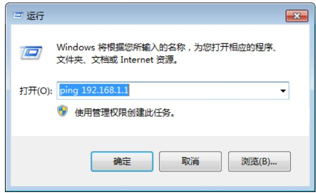

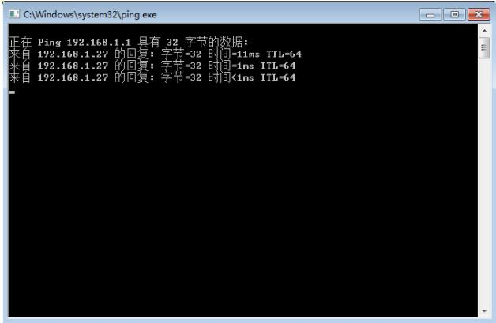

## 3.1.2 无线方式

## 1. 客户端计算机要求

确认计算机已安装了无线网卡，并处于开启状态。

将计算机放置于 CB304n的无线网络范围内。

2. 设置客户端计算机的IP地址

建议您将计算机设置成缺省的“自动获得 IP 地址”和“自动获得 DNS 服务器地址”，由 CB304n自动分配 IP地址。

## 说明

如果您想给计算机指定静态 IP地址，则需要将计算机的无线网卡的 IP地址与 CB304n的 IP地址设置在同一子网中（CB304n 缺省 IP 地址为：192.168.1.1，子网掩码为 255.255.255.0）。

## 3. 设置无线客户端

## 说明

本手册以 Windows7的无线网络设置功能为例进行介绍。

• 单击屏幕左下角<开始>按钮，进入[开始]菜单，选择[控制面板]，点击“网络和Internet”，打开“网络和共享中心”

• 单击“更改适配器设置”，显示无线网络连接界面

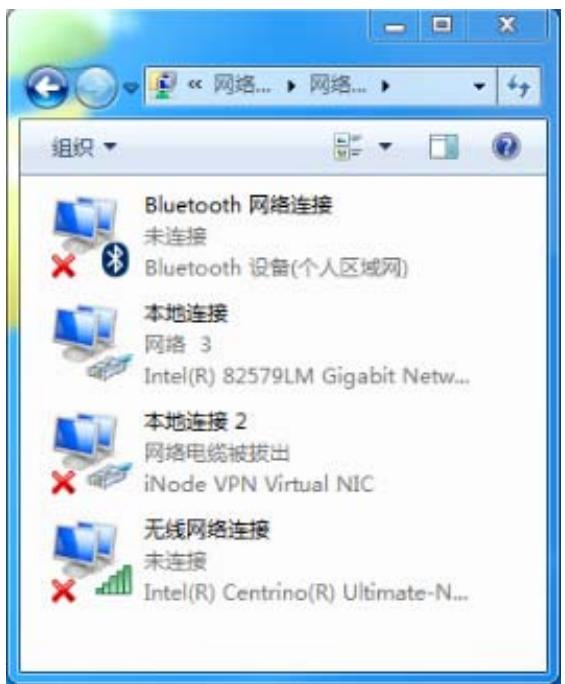

在“无线网络连接” 列表里找到需连接的无线网络，缺省情况下，CB304n提供一个名为

“ROUTE\_XXXXXX”的无线网络，XXXXXX为设备背面铭牌上MAC地址的后六位，且不加密，单击<连接(C)>按钮，即可连接成功

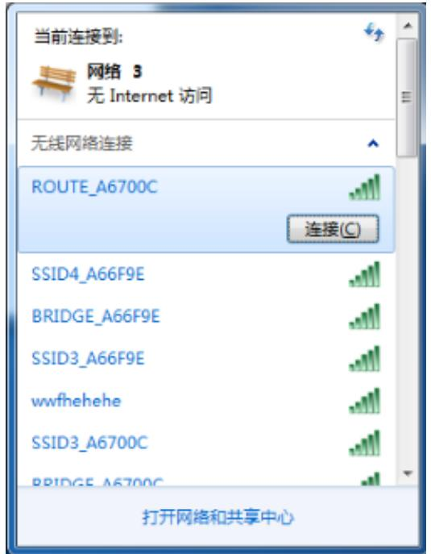

## 3.1.3 取消代理服务器

如果当前管理计算机使用代理服务器访问因特网，则必须取消代理服务，操作步骤如下：

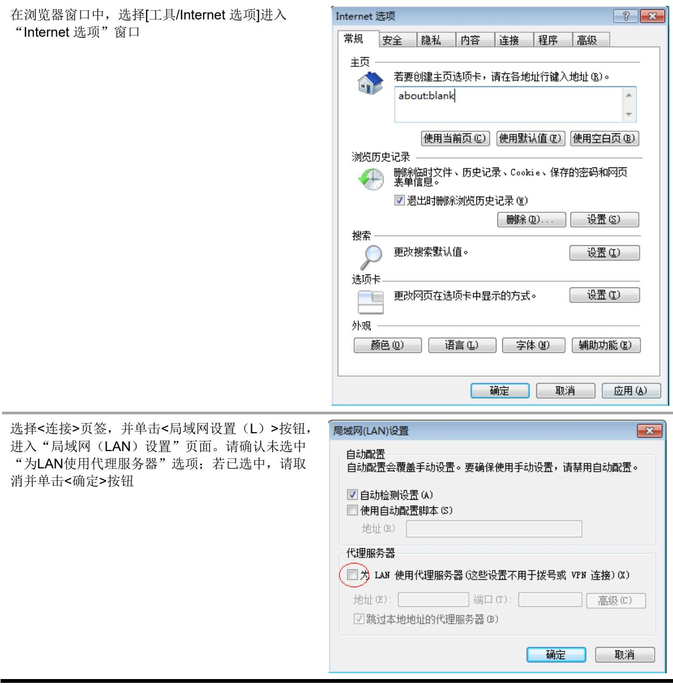

## 3.2 登录设备Web页面

运行Web浏览器，在地址栏中输入“http://192.168.1.1”，回车后跳转到Web登录页面，如 图 3-1所示，输入用户名、密码（缺省均为admin，区分大小写），单击<登录>按钮或直接回车即可进入Web设置页面。

图3-1 登录设备 Web设置页面  
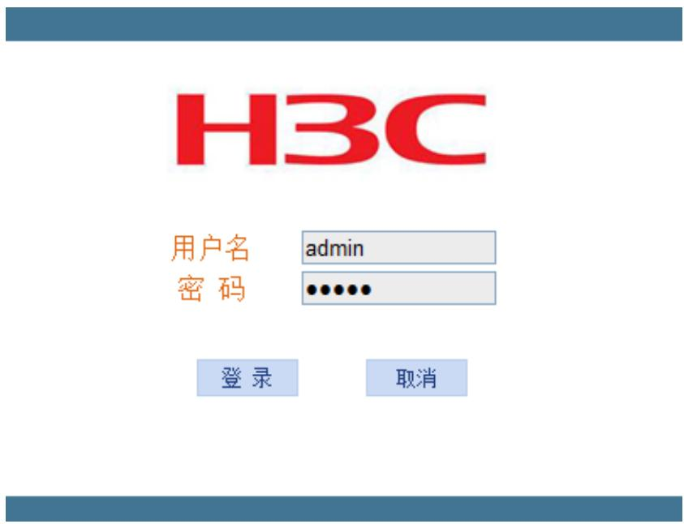

## 3.3 熟悉Web设置页面

设备提供非常简便的 Web设置页面，您可以通过该设置页面快速地完成所需功能的配置。

## 3.3.1 Web设置页面概述

成功登录后，出现Web设置页面。设备提供的Web页面主要分为两部分，如 图 3-2所示。

• 页面上方是一级导航栏。通过单击链接，可以进入相应的配置、管理页面。

页面左侧是二级导航栏及配置管理区域。右侧显示的内容根据导航栏选中的功能而定，详细信息请参见下面具体业务配置。

图3-2 Web设置页面  
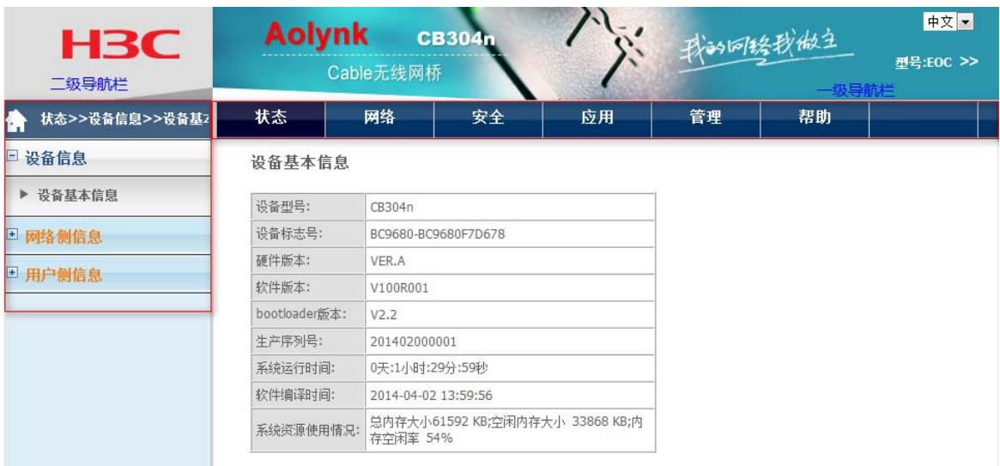

为了安全起见，建议您首次登录后修改缺省的登录密码，并保管好密码信息，修改登录密码操作请参见 4.4.1 用户管理。

## 3.3.2 退出

如 图 3-3所示，单击导航栏右上角的<退出>按钮，确认后即可退出Web设置页面。

图3-3 退出 Web设置页面  
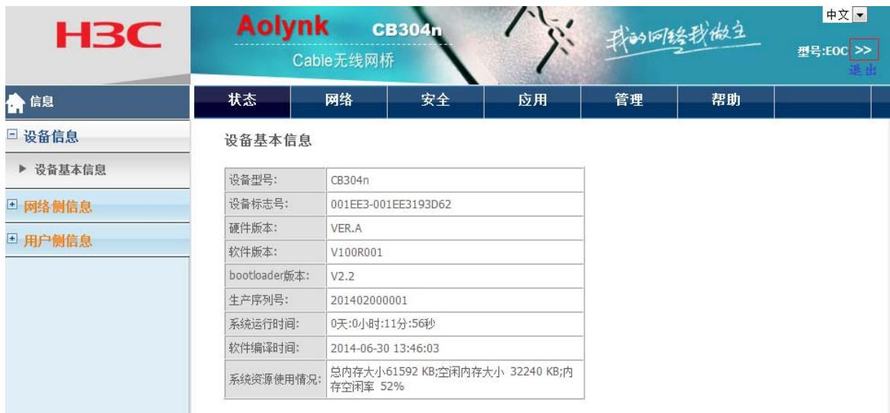

请勿通过直接关闭浏览器来退出 Web设置页面，因为这样操作用户并不能真正退出设备的 Web设置页面。

## 设备常用功能管理

## 4.1 网络

## 4.1.1 LAN侧地址配置

## 页面向导：网络→LAN侧地址配置→IPV4配置本页面为您提供如下主要功能：

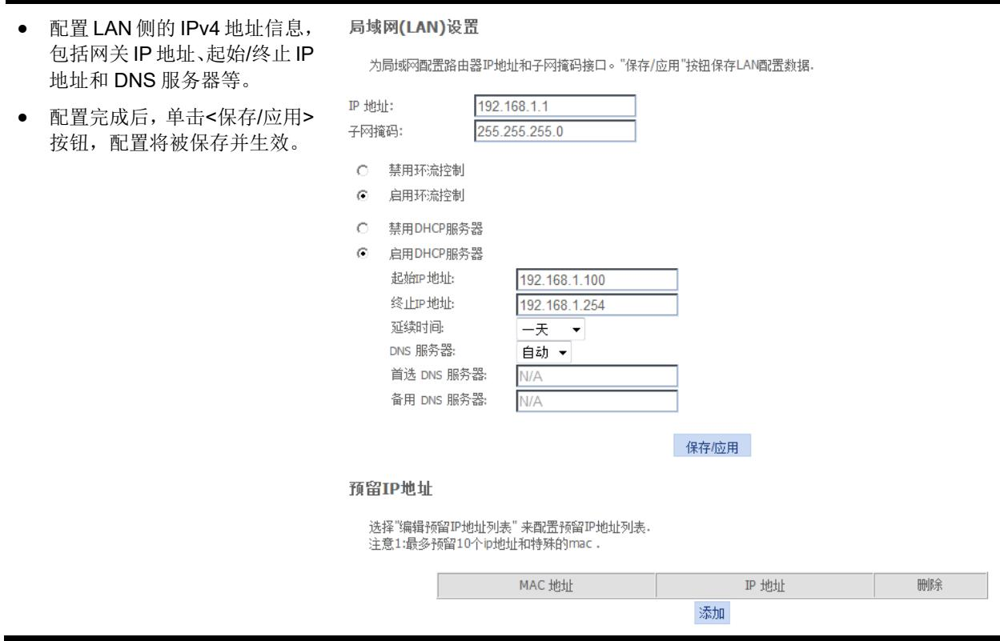

页面中关键项的含义如下表所示。

表4-1 页面关键项描述
<table><tr><td colspan="1" rowspan="1">页面关键项</td><td colspan="1" rowspan="1">描述</td></tr><tr><td colspan="1" rowspan="1">IP地址/子网掩码</td><td colspan="1" rowspan="1">配置网关的IP地址和子网掩码</td></tr><tr><td colspan="1" rowspan="1">禁用/启用环流控制</td><td colspan="1" rowspan="1">启用环流控制，即表示局域网侧开启STP（Spanning Tree Protocol，生成树协议）功能</td></tr><tr><td colspan="1" rowspan="1">禁用/启用DHCP服务器</td><td colspan="1" rowspan="1">● 开启网关的DHCP服务器功能，网关将自动为连接到网关的设备分配IP地址● 禁用网关的DHCP服务器功能，网关将不能为连接到网关的设备分配IP地址</td></tr><tr><td colspan="1" rowspan="1">起始/终止IP地址</td><td colspan="1" rowspan="1">启用DHCP服务器功能后，网关可指定设备的起始和终止IP地址</td></tr><tr><td colspan="1" rowspan="1">延续时间</td><td colspan="1" rowspan="1">DHCP服务器分配的租约时间</td></tr><tr><td colspan="1" rowspan="1">DNS服务器</td><td colspan="1" rowspan="1">● 自动：连接到网关的设备可以自动连接到局域网内的DNS服务器● 手动：手动设置连接到网关的设备需连接的局域网内的DNS服务器地址</td></tr><tr><td colspan="1" rowspan="1">首选/备用DNS服务器</td><td colspan="1" rowspan="1">配置首选和备用的DNS服务器</td></tr><tr><td colspan="1" rowspan="1">预留IP地址</td><td colspan="1" rowspan="1">通过&lt;添加&gt;或&lt;删除&gt;按钮，您可以添加或删除一个规则：一个MAC地址对应一个IP地址</td></tr></table>

## 4.1.2 无线配置

## 页面向导：网络→无线配置→无线配置

本页面为您提供如下主要功能：

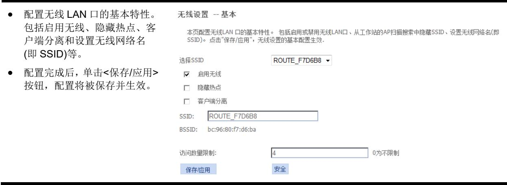

页面中关键项的含义如下表所示。

表4-2 页面关键项描述
<table><tr><td rowspan=1 colspan=1>页面关键项</td><td rowspan=1 colspan=1>描述</td></tr><tr><td rowspan=1 colspan=1>启用无线</td><td rowspan=1 colspan=1>启用或禁用无线网络，缺省为开启状态</td></tr><tr><td rowspan=1 colspan=1>隐藏热点</td><td rowspan=1 colspan=1>启用或禁用隐藏热点，启用后终端将无法通过扫描来获得设备的SSID</td></tr><tr><td rowspan=1 colspan=1>客户端分离</td><td rowspan=1 colspan=1>启用或禁用客户端分离，启用后可以使无线网络中的不同客户端之间相互隔离，不能通信</td></tr><tr><td rowspan=1 colspan=1>SSID</td><td rowspan=1 colspan=1>设置无线网络名，SSID用来区分不同的无线网络</td></tr><tr><td rowspan=1 colspan=1>BSSID</td><td rowspan=1 colspan=1>无线网络设备的MAC地址</td></tr><tr><td rowspan=1 colspan=1>访问数量限制</td><td rowspan=1 colspan=1>设置同时访问无线网络的用户数量</td></tr></table>

## 页面向导：网络→无线配置→无线配置→安全

本页面为您提供如下主要功能：

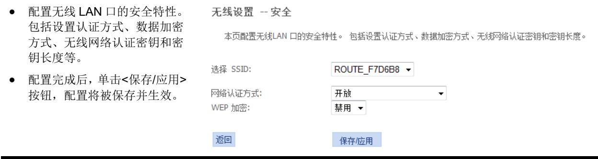

页面中关键项的含义如下表所示。

表4-3 页面关键项描述
<table><tr><td rowspan=1 colspan=1>页面关键项</td><td rowspan=1 colspan=1>描述</td></tr><tr><td rowspan=1 colspan=1>选择SSID</td><td rowspan=1 colspan=1>选择需要配置的无线网络</td></tr><tr><td rowspan=1 colspan=1>网络认证方式</td><td rowspan=1 colspan=1>可以选择开放、共享、WPA-PSK、WPA2-PSK、Mixed WPA2/WPA-PSK等认证方式</td></tr><tr><td rowspan=1 colspan=1>WEP加密</td><td rowspan=1 colspan=1>可以选择禁用或者启用</td></tr></table>

页面向导：网络→无线配置→无线配置→安全（以网络认证方式为 Mixed WPA2/WPA-PSK举例）本页面为您提供如下主要功能：

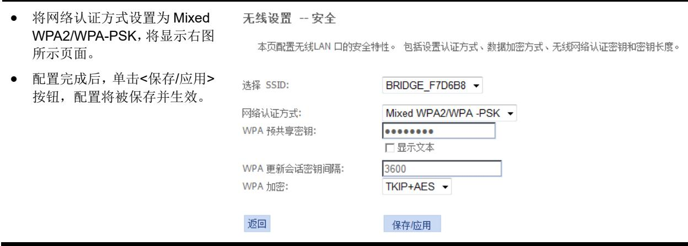

页面中关键项的含义如下表所示。

表4-4 页面关键项描述
<table><tr><td rowspan=1 colspan=1>页面关键项</td><td rowspan=1 colspan=1>描述</td></tr><tr><td rowspan=1 colspan=1>网络认证方式</td><td rowspan=1 colspan=1>设置无线认证方式，选择Mixed WPA2/WPA-PSK</td></tr><tr><td rowspan=1 colspan=1>WPA预共享密钥</td><td rowspan=1 colspan=1>设置WPA预共享密钥</td></tr><tr><td rowspan=1 colspan=1>显示文本</td><td rowspan=1 colspan=1>勾选该选项，WPA预共享密钥将以明文显示</td></tr><tr><td rowspan=1 colspan=1>WPA更新会话密钥间隔</td><td rowspan=1 colspan=1>设置WPA更新会话密钥间隔时间，缺省为3600s</td></tr><tr><td rowspan=1 colspan=1>WPA加密</td><td rowspan=1 colspan=1>设置WPA加密方式，可以选择TKIP、AES或TKIP+AES等加密方式</td></tr></table>

## 页面向导：网络→无线配置→无线高级配置

本页面为您提供如下主要功能：

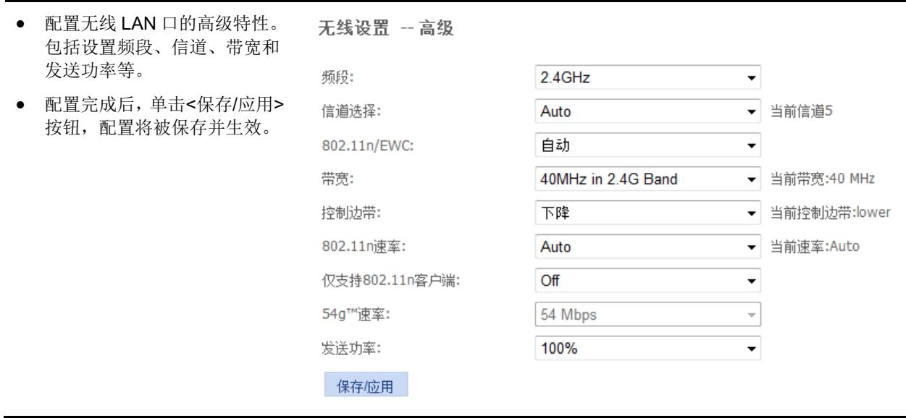

页面中关键项的含义如下表所示。

表4-5 页面关键项描述
<table><tr><td rowspan=1 colspan=1>页面关键项</td><td rowspan=1 colspan=1>描述</td></tr><tr><td rowspan=1 colspan=1>频段</td><td rowspan=1 colspan=1>无线使用的频段</td></tr><tr><td rowspan=1 colspan=1>信道选择</td><td rowspan=1 colspan=1>无线信息，有1-13选择，也可以选择Auto</td></tr><tr><td rowspan=1 colspan=1>802.11n/EWC</td><td rowspan=1 colspan=1>启用或禁用802.11n功能● 选择“自动”，开启802.11n模式，此时可以设置802.11n模式的速率；● 选择“禁用”，关闭802.11n模式，此时可以设置54g模式和前导类型</td></tr><tr><td rowspan=1 colspan=1>带宽</td><td rowspan=1 colspan=1>无线网络工作的带宽</td></tr><tr><td rowspan=1 colspan=1>控制边带</td><td rowspan=1 colspan=1>默认为降低控制边带</td></tr><tr><td rowspan=1 colspan=1>802.11n速率</td><td rowspan=1 colspan=1>设置802.11n工作的速率</td></tr><tr><td rowspan=1 colspan=1>仅支持802.11n客户端</td><td rowspan=1 colspan=1>是否启用仅支持802.11n客户端</td></tr><tr><td rowspan=1 colspan=1>54g™M速率</td><td rowspan=1 colspan=1>缺省为54Mbps</td></tr><tr><td rowspan=1 colspan=1>54g™模式选择</td><td rowspan=1 colspan=1>设置54g™M模式，默认为54g Auto</td></tr><tr><td rowspan=1 colspan=1>前导类型</td><td rowspan=1 colspan=1>设置前导类型，默认为long</td></tr><tr><td rowspan=1 colspan=1>发送功率</td><td rowspan=1 colspan=1>缺省为100%</td></tr></table>

## 4.2 安全

## 4.2.1 广域网访问控制

## 页面向导：安全→广域网访问控制→广域网访问控制本页面为您提供如下主要功能：

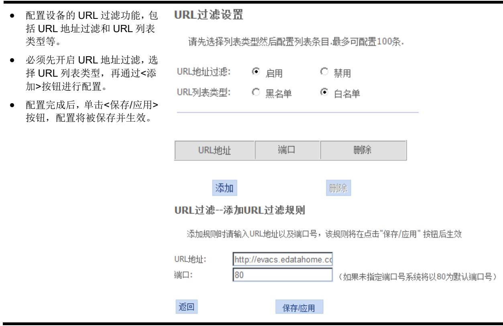

## 4.2.2 防火墙

## 1. 防火墙等级

## 页面向导：安全→防火墙→防火墙等级

## 2. 攻击保护设置

页面向导：安全→防火墙→攻击保护设置

本页面为您提供如下主要功能：

## 4.2.3 Mac过滤

## 页面向导：安全→Mac 过滤→Mac 过滤

本页面为您提供如下主要功能：

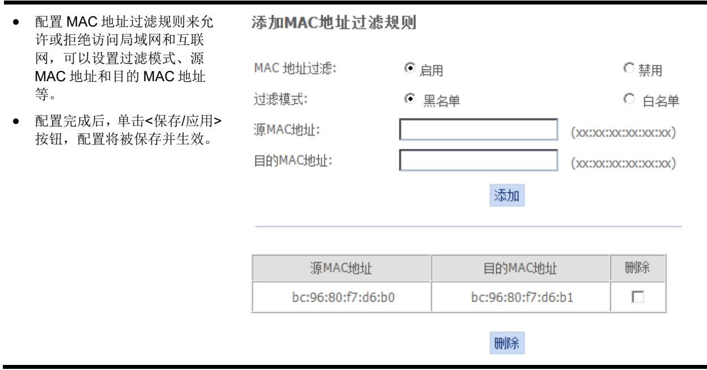

页面中关键项的含义如下表所示。

表4-6 页面关键项描述
<table><tr><td rowspan=1 colspan=1>页面关键项</td><td rowspan=1 colspan=1>描述</td></tr><tr><td rowspan=1 colspan=1>MAC地址过滤</td><td rowspan=1 colspan=1>禁用和开启MAC地址过滤功能，缺省处于禁用状态</td></tr><tr><td rowspan=1 colspan=1>过滤模式</td><td rowspan=1 colspan=1>可以配置过滤模式为白名单和黑名单：● 启用黑名单后，除加入黑名单的MAC地址不可以通过，其余均可通过•启用白名单后，除加入白名单的MAC地址可以通过，其余均不可通过</td></tr></table>

## 4.2.4 IP过滤

## 页面向导：安全→IP过滤→IP过滤本页面为您提供如下主要功能：

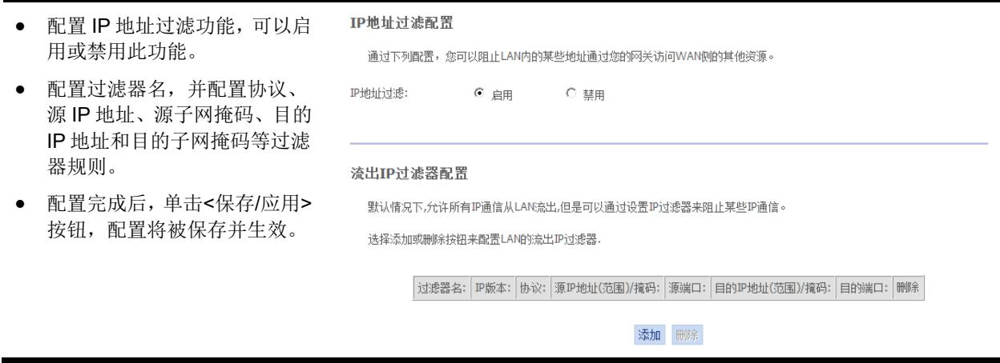

页面中关键项的含义如下表所示。

表4-7 页面关键项描述
<table><tr><td rowspan=1 colspan=1>页面关键项</td><td rowspan=1 colspan=1>描述</td></tr><tr><td rowspan=1 colspan=1>IP地址过滤</td><td rowspan=1 colspan=1>开启或禁用IP地址过滤功能，缺省处于开启状态</td></tr><tr><td rowspan=1 colspan=1>流出IP过滤器配置</td><td rowspan=1 colspan=1>配置流出IP过滤器来阻止某些IP通信</td></tr></table>

## 4.3 应用

## 4.3.1 DDNS配置

## 页面向导：应用→DDNS配置→DDNS配置

本页面为您提供如下主要功能：

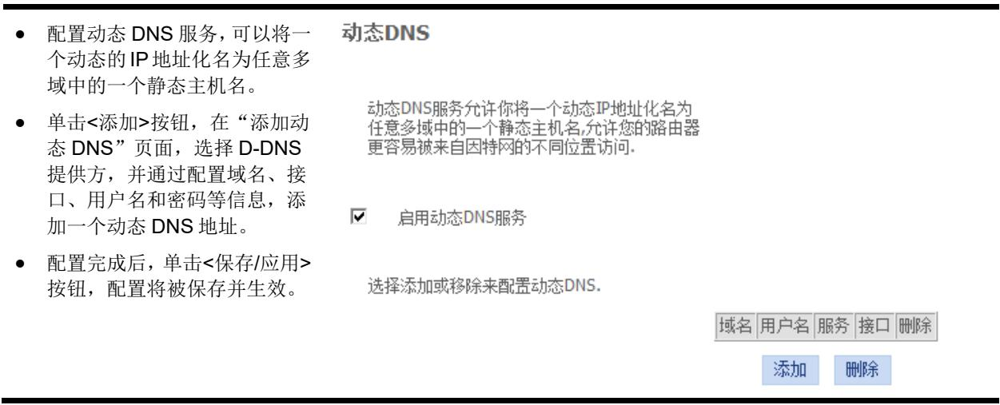

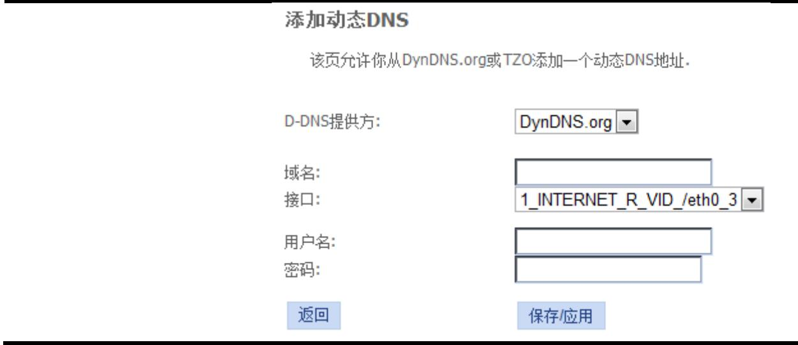

## 4.3.2 高级NAT配置

## 1. ALG配置

页面向导：应用→高级 NAT配置→ALG配置

本页面为您提供如下主要功能：

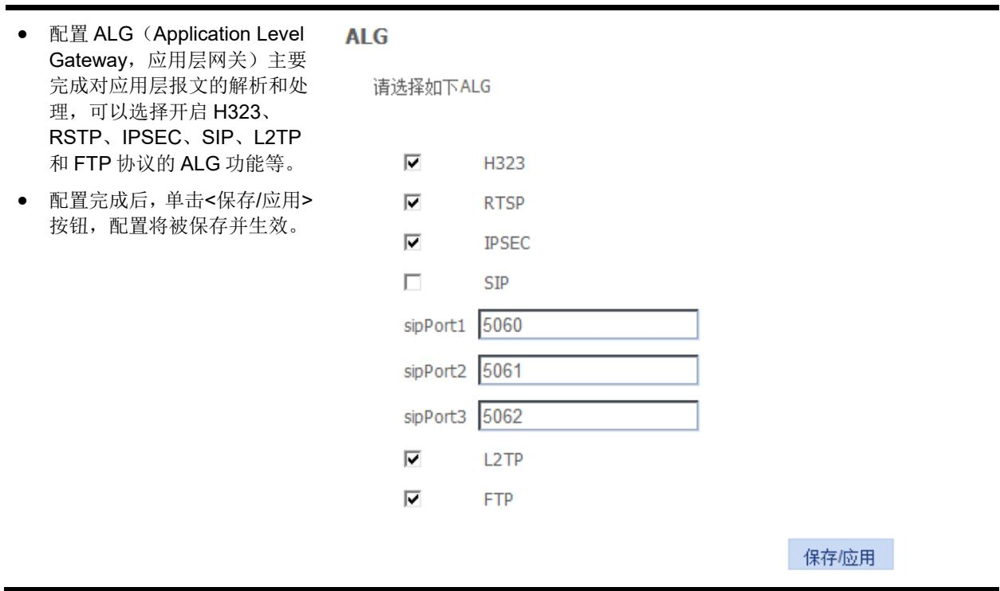

## 2. DMZ主机配置

页面向导：应用→高级 NAT配置→DMZ主机配置

本页面为您提供如下主要功能：

配置主机在DMZ下的主机可以无限制访问互联网，解决计算机不能够正常运行互联网应用程序等问题。不过这会使主机面临安全风险，请谨慎使用。

• 配置完成后，单击<保存/应用>按钮，配置将被保存并生效。

## NAT--DMZ主机

路由器将所有来自广域网中不属于虚拟服务列表中配置的应用的Ip报文发给DMZ主机

☑启用DMZ主机

输入电脑IP地址，然后点击"应用"按钮激活DMZ主机

清空IP地址输入框，然后点击"应用"按钮解除DMZ主机

DMZ主机IP地址：

192.168.1.18

保存/应用

## 3. 虚拟服务器配置

## 页面向导：应用→高级 NAT配置→虚拟服务器配置

## 本页面为您提供如下主要功能：

配置虚拟服务器，允许将WAN侧输入流(根据协议和端口识别)直接转发到LAN侧拥有私有地址的内部服务器。仅当外部端口需要转化为LAN侧服务器不同的端口时，内部端口才需设置。最多可配置32个条目。

• 配置完成后，单击<保存/应用>按钮，配置将被保存并生效。

## NAT--虚拟服务器设置

虚拟服务器允许将WAN侧输入流(根据协议和端口识别)直接转发到LAN侧拥有私有地址的内部服务器仅当外部端口需要转化为LAN侧服务器不同的端口时，内部端口才需设置

最多可配置32个条目.

添加

NAT--虚拟服务器设置

选择服务名并输入服务器的IP地址，然后点击”保存/应用”，为这项服务将IP包转发到指定的服务器。

注：通常内部结束端口不能直接修改。其值等于外部结束端口-外部开始端口+内部开始端口。端口值取值范围1-65535

选择WAN连接： 2 INTERNET R VID 201/eth0.201.3

服务器名称：

自定义服务器：

<table><tr><td rowspan=1 colspan=5>可剩余配置条目：32</td></tr><tr><td rowspan=1 colspan=1>外部开始端口</td><td rowspan=1 colspan=1>外部结束端口</td><td rowspan=1 colspan=1>协议</td><td rowspan=1 colspan=1>内部开始端口</td><td rowspan=1 colspan=1>内部结束端口</td></tr><tr><td rowspan=1 colspan=1></td><td rowspan=1 colspan=1></td><td rowspan=1 colspan=1>TCP</td><td rowspan=1 colspan=1></td><td rowspan=1 colspan=1></td></tr><tr><td rowspan=1 colspan=1></td><td rowspan=1 colspan=1></td><td rowspan=1 colspan=1>TCP     4</td><td rowspan=1 colspan=1></td><td rowspan=1 colspan=1></td></tr><tr><td rowspan=1 colspan=1></td><td rowspan=1 colspan=1></td><td rowspan=1 colspan=1>TCP</td><td rowspan=1 colspan=1></td><td rowspan=1 colspan=1></td></tr><tr><td rowspan=1 colspan=1></td><td rowspan=1 colspan=1></td><td rowspan=1 colspan=1>TCP</td><td rowspan=1 colspan=1></td><td rowspan=1 colspan=1></td></tr><tr><td rowspan=1 colspan=1></td><td rowspan=1 colspan=1></td><td rowspan=1 colspan=1>TCP</td><td rowspan=1 colspan=1></td><td rowspan=1 colspan=1></td></tr><tr><td rowspan=1 colspan=1></td><td rowspan=1 colspan=1></td><td rowspan=1 colspan=1>TCP</td><td rowspan=1 colspan=1></td><td rowspan=1 colspan=1></td></tr><tr><td rowspan=1 colspan=1></td><td rowspan=1 colspan=1></td><td rowspan=1 colspan=1>TCP</td><td rowspan=1 colspan=1></td><td rowspan=1 colspan=1></td></tr><tr><td rowspan=1 colspan=1></td><td rowspan=1 colspan=1></td><td rowspan=1 colspan=1>TCP     4</td><td rowspan=1 colspan=1></td><td rowspan=1 colspan=1></td></tr><tr><td rowspan=1 colspan=1></td><td rowspan=1 colspan=1></td><td rowspan=1 colspan=1>TCP</td><td rowspan=1 colspan=1></td><td rowspan=1 colspan=1></td></tr><tr><td rowspan=1 colspan=1></td><td rowspan=1 colspan=1></td><td rowspan=1 colspan=1>TCP</td><td rowspan=1 colspan=1></td><td rowspan=1 colspan=1></td></tr><tr><td rowspan=1 colspan=1></td><td rowspan=1 colspan=1></td><td rowspan=1 colspan=1>TCP</td><td rowspan=1 colspan=1></td><td rowspan=1 colspan=1></td></tr><tr><td rowspan=1 colspan=1></td><td rowspan=1 colspan=1></td><td rowspan=1 colspan=1>TCP</td><td rowspan=1 colspan=1></td><td rowspan=1 colspan=1></td></tr></table>

保存/应用

页面中关键项的含义如下表所示。

表4-8 页面关键项描述
<table><tr><td rowspan=1 colspan=1>页面关键项</td><td rowspan=1 colspan=1>描述</td></tr><tr><td rowspan=1 colspan=1>服务器名</td><td rowspan=1 colspan=1>选择一项服务，例如SMTP、POP、HTTP、FTP Server等，被选择服务对应的端口号将被显示在下表框</td></tr><tr><td rowspan=1 colspan=1>自定义服务器</td><td rowspan=1 colspan=1>输入一个新的服务名建立指定的用户服务类型</td></tr><tr><td rowspan=1 colspan=1>服务器IP地址</td><td rowspan=1 colspan=1>分配一个指定的地址到虚拟服务器</td></tr><tr><td rowspan=1 colspan=1>外部开始/结束端口</td><td rowspan=1 colspan=1>当选择了一种服务，端口号自动显示，也可以根据需要更改</td></tr><tr><td rowspan=1 colspan=1>协议</td><td rowspan=1 colspan=1>为服务选择正确的协议</td></tr><tr><td rowspan=1 colspan=1>内部开始/结束端口</td><td rowspan=1 colspan=1>当选择了一种服务，端口号自动显示，也可以根据需要更改。其中内部结束端口不能手动修改</td></tr></table>

## 4.3.3 upnp配置

页面向导：应用→upnp 配置→upnp 配置

本页面为您提供如下主要功能：

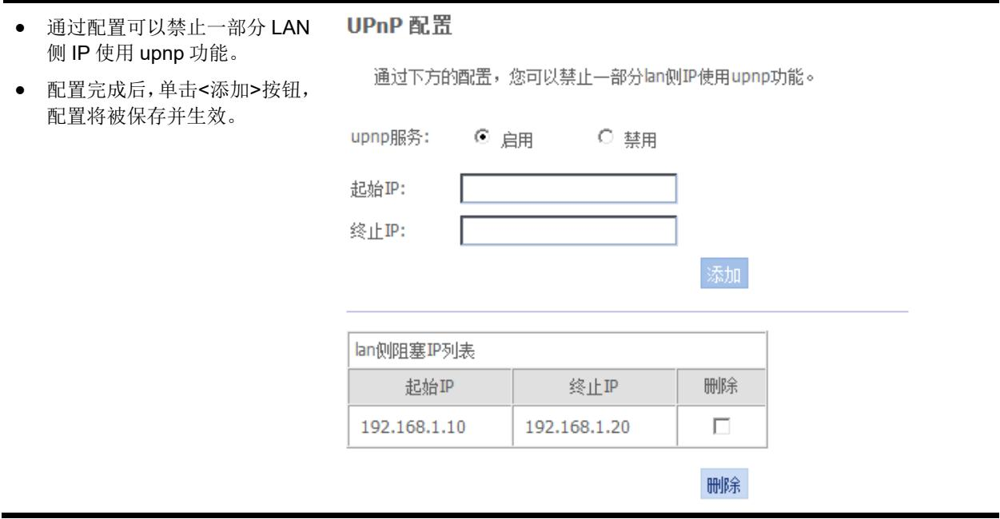

## 4.3.4 IGMP配置

1. IGMP SNOOPING

页面向导：应用→IGMP 配置→IGMP SNOOPING

本页面为您提供如下主要功能：

• 启用或禁止 IGMP Snooping功能，使得用户可以通过路由器观看IPTV节目。

• 配置完成后，单击<保存/应用>按钮，配置将被保存并生效。

## IGMP Snooping 配置

这个页面允许你启用或者禁用IGMPSnooping功能。

启用IGMP Snooping

标准模式

C阻塞模式

保存/应用

页面中关键项的含义如下表所示。

表4-9 页面关键项描述
<table><tr><td rowspan=1 colspan=1>页面关键项</td><td rowspan=1 colspan=1>描述</td></tr><tr><td rowspan=1 colspan=1>标准模式</td><td rowspan=1 colspan=1>在标准模式下，如果没有组播转发条目，数据流将会洪泛</td></tr><tr><td rowspan=1 colspan=1>阻塞模式</td><td rowspan=1 colspan=1>在阻塞模式下，如果没有组播转发条目，数据流将会丢弃</td></tr></table>

## 2. IGMP 代理

页面向导：应用→IGMP配置→IGMP代理

本页面为您提供如下主要功能：

配置IGMP 代理功能，使得用户可以通过路由器观看IPTV节目。

IGMP 服务器设定

启用服务器功能可以允许使用者在局端网络使用因特网服务器的多媒体服务

配置完成后，单击<保存/应用>按钮，配置将被保存并生效。 IGMP配置

这个页面允许你针对特定WAN连接启用IGMP代理

<table><tr><td>因特网连接</td><td>IGMP 服务器启用</td></tr><tr><td>1_INTERNET_R_VID_</td><td>V</td></tr></table>

保存/应用

## 4.4 管理

## 4.4.1 用户管理

页面向导：管理→用户管理→用户管理

本页面为您提供如下主要功能：

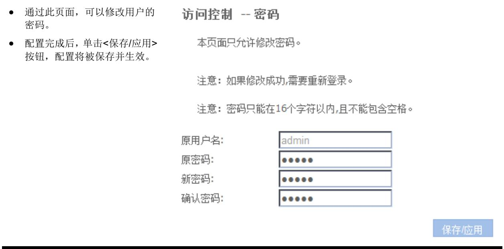

## 4.4.2 设备管理

## 1. 设备重启

页面向导：管理→设备管理→设备重启

本页面为您提供如下主要功能：

<table><tr><td rowspan="2">单击&lt;重启&gt;按钮，将完成路由器重 启功能。</td><td></td><td></td><td></td><td></td><td></td><td></td></tr><tr><td>状态</td><td>网络</td><td>安全</td><td>应用</td><td>管理</td><td>帮助</td></tr><tr><td></td><td colspan="6">点击如下按钮重启路由器。</td></tr><tr><td></td><td colspan="6"></td></tr><tr><td></td><td colspan="6"></td></tr><tr><td></td><td></td><td></td><td>重启</td><td></td><td></td><td></td></tr></table>

## 2. 恢复出厂设置

页面向导：管理→设备管理→恢复出厂设置

本页面为您提供如下主要功能：

## 3. 更新备份配置

页面向导：管理→设备管理→更新备份配置

本页面为您提供如下主要功能：

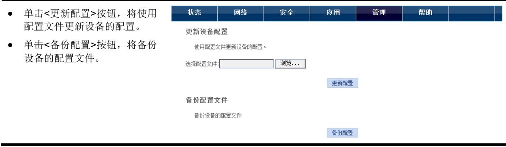

## 4.5 状态

## 4.5.1 设备信息

## 1. 设备基本信息

页面向导：状态→设备信息→设备基本信息本页面为您提供如下主要功能：

查看设备的基本信息，包括：设备型号、设备标志号、硬件版本、软件版本、bootloader版本、生产序列号、系统运行时间、软件编译时间和系统资源使用情况等。

<table><tr><td rowspan=1 colspan=1>设备型号：</td><td rowspan=1 colspan=1>CB304n</td></tr><tr><td rowspan=1 colspan=1>设备标志号：</td><td rowspan=1 colspan=1>BC9680-BC9680F7D6B8</td></tr><tr><td rowspan=1 colspan=1>硬件版本：</td><td rowspan=1 colspan=1>VER.A</td></tr><tr><td rowspan=1 colspan=1>软件版本：</td><td rowspan=1 colspan=1>V100R001</td></tr><tr><td rowspan=1 colspan=1>bootloader版本:</td><td rowspan=1 colspan=1>V2.2</td></tr><tr><td rowspan=1 colspan=1>生产序列号：</td><td rowspan=1 colspan=1>201402000001</td></tr><tr><td rowspan=1 colspan=1>系统运行时间：</td><td rowspan=1 colspan=1>0天:0小时:53分:54秒</td></tr><tr><td rowspan=1 colspan=1>软件编译时间：</td><td rowspan=1 colspan=1>2014-07-21 09:47:25</td></tr><tr><td rowspan=1 colspan=1>系统资源使用情况：</td><td rowspan=1 colspan=1>总内存大小61592KB;空闲内存大小31700KB;内存空闲率51%</td></tr></table>

页面中关键项的含义如下表所示。

表4-10 页面关键项描述
<table><tr><td colspan="1" rowspan="1">页面关键项</td><td colspan="1" rowspan="1">描述</td></tr><tr><td colspan="1" rowspan="1">设备型号</td><td colspan="1" rowspan="1">显示当前设备的型号</td></tr><tr><td colspan="1" rowspan="1">设备标志号</td><td colspan="1" rowspan="1">显示当前设备的设备标志号</td></tr><tr><td colspan="1" rowspan="1">硬件版本</td><td colspan="1" rowspan="1">显示当前设备的硬件版本</td></tr><tr><td colspan="1" rowspan="1">软件版本</td><td colspan="1" rowspan="1">显示设备当前运行软件的版本号  说明页面中的软件版本信息仅作参考，请以设备加载软件版本后的最终显示为准</td></tr><tr><td colspan="1" rowspan="1">bootloader版本</td><td colspan="1" rowspan="1">显示设备的bootloader程序版本号</td></tr><tr><td colspan="1" rowspan="1">生产序列号</td><td colspan="1" rowspan="1">显示设备的生产序列号</td></tr><tr><td colspan="1" rowspan="1">系统运行时间</td><td colspan="1" rowspan="1">显示设备自启动后持续运行的时间</td></tr><tr><td colspan="1" rowspan="1">软件编译时间</td><td colspan="1" rowspan="1">显示设备当前运行软件的编译时间</td></tr><tr><td colspan="1" rowspan="1">系统资源使用情况</td><td colspan="1" rowspan="1">显示设备系统资源使用信息，便于您判断设备运行是否正常</td></tr></table>

## 4.5.2 网络侧信息

## 1. IPV4 连接信息

页面向导：状态→网络侧信息→IPV4连接信息

本页面为您提供如下主要功能：

• 通过此页面可以查看网络侧已配置的IPv4的连接信息。

WAN 连接信息

• 单击“刷新”按钮，将刷新WAN连接信息。

<table><tr><td rowspan=1 colspan=1>接口名</td><td rowspan=1 colspan=1>接口描述</td><td rowspan=1 colspan=1>类型</td><td rowspan=1 colspan=1>VlanMuxId</td><td rowspan=1 colspan=1>IGMP</td><td rowspan=1 colspan=1>NAT</td><td rowspan=1 colspan=1>防火墙</td><td rowspan=1 colspan=1>状态</td><td rowspan=1 colspan=1>DNS地址</td><td rowspan=1 colspan=1>IPv4地址</td></tr><tr><td rowspan=1 colspan=1>eth0_3</td><td rowspan=1 colspan=1>1_INTERNET_R_VID</td><td rowspan=1 colspan=1>IPoE</td><td rowspan=1 colspan=1>禁用</td><td rowspan=1 colspan=1>启用</td><td rowspan=1 colspan=1>启用</td><td rowspan=1 colspan=1>启用</td><td rowspan=1 colspan=1>Connecting</td><td rowspan=1 colspan=1></td><td rowspan=1 colspan=1></td></tr></table>

网络信息

<table><tr><td rowspan=1 colspan=1>默认网关</td><td rowspan=1 colspan=1></td></tr><tr><td rowspan=1 colspan=1>子网掩码</td><td rowspan=1 colspan=1></td></tr><tr><td rowspan=1 colspan=1>首选DNS服务器</td><td rowspan=1 colspan=1></td></tr><tr><td rowspan=1 colspan=1>备用DNS服务器</td><td rowspan=1 colspan=1></td></tr></table>

刷新

## 4.5.3 用户侧信息

## 1. WLAN接口信息

页面向导：状态→用户侧信息→WLAN接口信息

本页面为您提供如下主要功能：

<table><tr><td>通过此页面可以查看用户侧已配 置的WLAN接口的连接信息</td><td colspan="4">WLAN接口信息</td></tr><tr><td></td><td>SSID名称</td><td>无线网络连接状态</td><td>当前信道</td><td>SSID加密认证方式</td></tr><tr><td></td><td>ROUTE_F7D6B8</td><td>启用</td><td></td><td>开放</td></tr></table>

## 2. 以太网接口信息

页面向导：状态→用户侧信息→以太网接口信息

本页面为您提供如下主要功能：

<table><tr><td rowspan=1 colspan=2>MAC 地址</td><td></td><td></td></tr><tr><td rowspan=1 colspan=1>IP 地址</td><td rowspan=1 colspan=1>剩余租借期</td><td rowspan=1 colspan=1>MAC 地址</td><td rowspan=1 colspan=1>设备类型</td></tr><tr><td rowspan=1 colspan=1>192.168.11.100</td><td rowspan=1 colspan=1>80046s</td><td rowspan=1 colspan=1>d4:97:0b:88:bb:7d</td><td rowspan=1 colspan=1>计算机</td></tr><tr><td rowspan=1 colspan=1>192.168.11.101</td><td rowspan=1 colspan=1>80658s</td><td rowspan=1 colspan=1>c4:6a:b7:51:9c:9f</td><td rowspan=1 colspan=1>计算机</td></tr><tr><td rowspan=1 colspan=1>192.168.11.106</td><td rowspan=1 colspan=1>84923s</td><td rowspan=1 colspan=1>88:32:9b:e9:29:ab</td><td rowspan=1 colspan=1>计算机</td></tr><tr><td rowspan=1 colspan=1>192.168.11.103</td><td rowspan=1 colspan=1>86307s</td><td rowspan=1 colspan=1>bc:3b:af:0c:71:4b</td><td rowspan=1 colspan=1>计算机</td></tr><tr><td rowspan=1 colspan=1>192.168.11.104</td><td rowspan=1 colspan=1>85216s</td><td rowspan=1 colspan=1>60:c5:47:61:07:6c</td><td rowspan=1 colspan=1>计算机</td></tr><tr><td rowspan=1 colspan=1>192.168.11.107</td><td rowspan=1 colspan=1>85499s</td><td rowspan=1 colspan=1>6c:c2:6b:48:3a:e3</td><td rowspan=1 colspan=1>计算机</td></tr><tr><td rowspan=1 colspan=1>192.168.11.108</td><td rowspan=1 colspan=1>86154s</td><td rowspan=1 colspan=1>6c:8b:2f:7f:3b:f9</td><td rowspan=1 colspan=1>计算机</td></tr><tr><td rowspan=1 colspan=1>192.168.11.110</td><td rowspan=1 colspan=1>86161s</td><td rowspan=1 colspan=1>60:fa:cd:07:a6:46</td><td rowspan=1 colspan=1>摄像头</td></tr><tr><td rowspan=1 colspan=1>192.168.11.111</td><td rowspan=1 colspan=1>86186s</td><td rowspan=1 colspan=1>bc:c6:db:d0:65:56</td><td rowspan=1 colspan=1>摄像头</td></tr><tr><td rowspan=1 colspan=1>192.168.11.127</td><td rowspan=1 colspan=1>0s</td><td rowspan=1 colspan=1>74:46:a0:aa:78:25</td><td rowspan=1 colspan=1>计算机</td></tr></table>

## 4.6 帮助

单击一级导航<帮助>页签，可以查看设备的帮助信息。如 图 4-1所示。

图4-1 设备帮助信息
<table><tr><td rowspan=2 colspan=1>H3C</td><td></td><td></td><td></td><td></td><td></td><td></td><td></td><td></td><td></td></tr><tr><td rowspan=1 colspan=9>Aolynk                                                                 中文CB304n我的网终我做主型号:EOC &gt;&gt;Cable无线网桥</td></tr><tr><td rowspan=1 colspan=1>帮助</td><td rowspan=1 colspan=2>状态</td><td rowspan=1 colspan=1>网络</td><td rowspan=1 colspan=1>安全</td><td rowspan=1 colspan=1>应用</td><td rowspan=1 colspan=1>管理</td><td rowspan=1 colspan=1>帮助</td><td rowspan=1 colspan=1></td><td rowspan=1 colspan=1></td></tr><tr><td rowspan=1 colspan=1>状态帮助</td><td rowspan=1 colspan=3>设备信息帮助</td><td rowspan=4 colspan=2>号，设备标识号，硬件版本，软件版本，b</td><td rowspan=2 colspan=1></td><td rowspan=2 colspan=2></td><td rowspan=12 colspan=1></td></tr><tr><td rowspan=3 colspan=1>设备信息帮助网络侧信息帮助用户侧信息帮助</td><td rowspan=3 colspan=3>设备基本信息设备基本信息页面显示设备型时间，系统资源使用情况</td></tr><tr><td rowspan=1 colspan=1>ootloader版本，生</td><td rowspan=1 colspan=1>产序列号，系统运行</td><td rowspan=1 colspan=1>时间，软件编译</td></tr><tr><td rowspan=9 colspan=1></td><td rowspan=9 colspan=1></td><td rowspan=9 colspan=1></td></tr><tr><td rowspan=1 colspan=1>网络帮助</td><td rowspan=1 colspan=3></td><td rowspan=1 colspan=1></td><td rowspan=5 colspan=1></td></tr><tr><td rowspan=2 colspan=1>安全帮助</td><td></td><td rowspan=1 colspan=1></td><td rowspan=2 colspan=1></td><td rowspan=2 colspan=1></td></tr><tr><td></td><td rowspan=1 colspan=1></td></tr><tr><td rowspan=2 colspan=1>应用帮助</td><td></td><td rowspan=1 colspan=1></td><td rowspan=2 colspan=1></td><td rowspan=2 colspan=1></td></tr><tr><td></td><td rowspan=1 colspan=1></td></tr><tr><td rowspan=2 colspan=1>管理帮助</td><td></td><td rowspan=1 colspan=1></td><td rowspan=2 colspan=1></td><td rowspan=2 colspan=1></td><td rowspan=2 colspan=1></td></tr><tr><td></td><td rowspan=1 colspan=1></td></tr><tr><td rowspan=1 colspan=1></td><td rowspan=1 colspan=3></td><td rowspan=1 colspan=1></td><td rowspan=1 colspan=1></td></tr></table>

## 附录 – 故障排除

本手册仅介绍简单的设备故障处理方法，如仍不能排除，可通过 表 5-2获取售后服务。

表5-1 故障排除
<table><tr><td colspan="1" rowspan="1">常见问题</td><td colspan="1" rowspan="1">故障排除</td></tr><tr><td colspan="1" rowspan="1">插上电源后，所有指示灯不亮</td><td colspan="1" rowspan="1">请首先确认设备的电源适配器与电源插座连接正常，且设备电源开关已打开（即开关按钮已按下）。确认后如指示灯仍不亮，则可能电源适配器或设备已损坏。请联系当地运营商进行维修，切勿私自拆开设备</td></tr><tr><td colspan="1" rowspan="1">设备的Cable指示灯始终不亮</td><td colspan="1" rowspan="1">Cable指示灯若始终不亮表示Cable链路没有建立成功。请确认设备Cable口的同轴电缆是否插牢，同轴电缆另一端与入户接口是否连接正确。确认后如指示灯依然不亮，请与运营商联系，以确定是否为远端机房的EoC业务问题或运营商网络链路故障所致</td></tr><tr><td colspan="1" rowspan="1">搜索不到设备发出的无线信号或信号很弱</td><td colspan="1" rowspan="1">(1) 确认计算机的无线网卡是否正常运作(2) 确认是否关闭了本产品的 SSID广播功能(3)如无线网卡距离设备太远，请靠近再扫描一次(4)确认附近是否有无线电话、微波炉或其他无线干扰源(5)确认设备的无线端口是否已激活。如不能确定，请恢复出厂值后重新扫描  说明使用设备时应尽量远离无线电话和微波炉等产品，以消除频率干扰。而封闭空间、金属障碍物或混凝土墙壁等也会显著降低AP的覆盖范围</td></tr><tr><td colspan="1" rowspan="1">从无线网卡上可以发现无线信号但却无法建立无线连接</td><td colspan="1" rowspan="1">(1) 请确认计算机的无线网卡驱动程序是否已正确安装，在其它的无线环境中是否能正常使用。如果您的无线网卡曾经在其它环境中设置并使用过，请检查是否原先预设的profile参数有影响，可尝试将原有的无线设置清除后再重新连接本设备  说明关于计算机无线网卡的安装、设置和使用，可咨询您的无线网卡生产厂商或设备提供商(2) 请确认无线网卡已搜索到并选择了正确的设备以建立连接(3) 请检查无线网卡参数的设置是否与设备相一致，如：SSID名称，加密与否，加密类型和密钥  说明设备标贴上有该设备的缺省的无线网络名称、默认加密方式和密钥(4) 如您曾进行MAC/IP地址过滤设置，请确认“MAC/IP过滤”未屏蔽您的无线网卡</td></tr><tr><td colspan="1" rowspan="1">不能正常上网</td><td colspan="1" rowspan="1">先检查设备是否正常工作，再检查网线是否正常，确保其与设备之间的连接是可靠的如果设备工作正常，可能是您的计算机或者应用网络出现了问题。如果设备工作不正常，请根据具体的指示灯状态进行排查，或联系运营商解决</td></tr><tr><td>无法校验密码</td><td>设备同步、连接一切正常，但有时仍会出现无法校验密码的情况 (1) 注意帐号和密码要区分大小写，并注意帐号是否包含域名 (2) 虚拟拨号软件出现问题，或与您的操作系统里的某些软件有冲 突。建议您最好重装拨号软件，或更换另外的软件尝试 (3) 网卡驱动程序出现问题 (4) 欠费，请及时交费</td></tr></table>

表5-2 获取售后服务
<table><tr><td rowspan=1 colspan=1>故障类型</td><td rowspan=1 colspan=1>描述</td><td rowspan=1 colspan=1>如何获取售后服务</td></tr><tr><td rowspan=1 colspan=1>硬件类故障</td><td rowspan=1 colspan=1>比如：出现设备不能正常通电、未插网线但以太网端口指示灯却常亮等问题</td><td rowspan=1 colspan=1>请联系当地授权服务中心予以确认后更换（各地区的H3C授权服务中心的联系方式可在H3C官方网站找到）</td></tr><tr><td rowspan=1 colspan=1>软件类问题</td><td rowspan=1 colspan=1>比如：出现设备功能不可用、异常等问题或配置咨询</td><td rowspan=1 colspan=1>请联系H3C技术支持服务热线：400-810-0504获取帮助</td></tr></table>

## 附录 – 产品术语

表6-1 术语表
<table><tr><td colspan="1" rowspan="1">术语缩写</td><td colspan="1" rowspan="1">英文全称</td><td colspan="1" rowspan="1">中文名称</td><td colspan="1" rowspan="1">含义</td></tr><tr><td colspan="1" rowspan="1">100Base-TX</td><td colspan="1" rowspan="1">100Base-TX</td><td colspan="1" rowspan="1">100Base-TX</td><td colspan="1" rowspan="1">100Mbit/s基带以太网规范，使用两对5类双绞线连接，可提供最大100Mbit/s的传输速率</td></tr><tr><td colspan="1" rowspan="1">10Base-T</td><td colspan="1" rowspan="1">10Base-T</td><td colspan="1" rowspan="1">10Base-T</td><td colspan="1" rowspan="1">10Mbit/s基带以太网规范，使用两对双绞线（3/4/5类双绞线）连接，其中一对用于发送数据，另一对用于接收数据，提供最大10Mbit/s传输速率</td></tr><tr><td colspan="1" rowspan="1">AP</td><td colspan="1" rowspan="1">Access Point</td><td colspan="1" rowspan="1">接入点</td><td colspan="1" rowspan="1">作为无线网络中重要的环节无线接入点、无线网关也就是无线AP（Access Point），它的作用类似于我们常用的有线网络中的集线器</td></tr><tr><td colspan="1" rowspan="1">DDNS</td><td colspan="1" rowspan="1">DynamicDomain NameService</td><td colspan="1" rowspan="1">动态域名服务</td><td colspan="1" rowspan="1">动态域名服务（Dynamic Domain Name Service），能实现固定域名到动态IP地址之间的解析</td></tr><tr><td colspan="1" rowspan="1">DHCP</td><td colspan="1" rowspan="1">Dynamic HostConfigurationProtocol</td><td colspan="1" rowspan="1">动态主机配置协议</td><td colspan="1" rowspan="1">动态主机配置协议（Dynamic Host ConfigurationProtocol）为网络中的主机动态分配IP地址、子网掩码、网关等信息</td></tr><tr><td colspan="1" rowspan="1">DHCP Server</td><td colspan="1" rowspan="1">Dynamic HostConfigurationProtocol Server</td><td colspan="1" rowspan="1">DHCP 服务器</td><td colspan="1" rowspan="1">动态主机配置协议服务器（Dynamic Host ConfigurationProtocol Server）是一台运行了DHCP动态主机配置协议的设备，主要用于给DHCP客户端分配IP地址</td></tr><tr><td colspan="1" rowspan="1">DMZ</td><td colspan="1" rowspan="1">Demilitarizedzone</td><td colspan="1" rowspan="1">隔离区</td><td colspan="1" rowspan="1">为了解决安装防火墙后外部网络不能访问内部网络服务器的问题，而设立的一个非安全系统与安全系统之间的缓冲区。通过这样一个DMZ区域，能更加有效地保护了内部网络，因为对攻击者来说，又多了一道关卡</td></tr><tr><td colspan="1" rowspan="1">DNS</td><td colspan="1" rowspan="1">Domain NameService</td><td colspan="1" rowspan="1">域名服务</td><td colspan="1" rowspan="1">域名服务（Domain Name Service）将域名解析成IP地址。DNS信息按等级分布在整个因特网上的DNS服务器间，当我们访问一个网址时，DNS服务器查看发出请求的域名并搜寻它所对应的IP地址。如果该DNS服务器无法找到这个IP地址，就将请求传送给上级DNS服务器，继续搜寻IP地址。例如，www.yahoo.com 这个域名所对应的IP地址为 216.115.108.243</td></tr><tr><td colspan="1" rowspan="1">DoS</td><td colspan="1" rowspan="1">Denial ofService</td><td colspan="1" rowspan="1">拒绝服务</td><td colspan="1" rowspan="1">拒绝服务（Denial of Service）是一种利用合法的方式请求占用过多的服务资源，从而使其他用户无法得到服务响应的网络攻击行为</td></tr><tr><td colspan="1" rowspan="1">DSL</td><td colspan="1" rowspan="1">DigitalSubscriber Line</td><td colspan="1" rowspan="1">数字用户线路</td><td colspan="1" rowspan="1">数字用户线（Digital Subscriber Line）这种技术使得数字数据和仿真语音信号都可以在现有的电话线路上进行传输。目前比较受家庭用户青睐的是ADSL接入方式</td></tr><tr><td colspan="1" rowspan="1">Firewall</td><td colspan="1" rowspan="1">Firewall</td><td colspan="1" rowspan="1">防火墙</td><td colspan="1" rowspan="1">防火墙（Firewall）技术保护您的计算机或局域网免受来自外网的恶意攻击或访问</td></tr><tr><td colspan="1" rowspan="1">FTP</td><td colspan="1" rowspan="1">File TransferProtocol</td><td colspan="1" rowspan="1">文件传输协议</td><td colspan="1" rowspan="1">文件传输协议（File Transfer Protocol）是一种描述网络上的计算机之间如何传输文件的协议</td></tr><tr><td colspan="1" rowspan="1">HTTP</td><td colspan="1" rowspan="1">HypertextTransferProtocol</td><td colspan="1" rowspan="1">超文本传送协议</td><td colspan="1" rowspan="1">超文本传送协议（Hypertext Transfer Protocol）是一种主要用于传输网页的标准协议</td></tr><tr><td colspan="1" rowspan="1">Hub</td><td colspan="1" rowspan="1">Hub</td><td colspan="1" rowspan="1">集线器</td><td colspan="1" rowspan="1">共享式网络连接设备，工作在物理层，主要用于扩展局域网规模</td></tr><tr><td colspan="1" rowspan="1">ISP</td><td colspan="1" rowspan="1">Internet ServiceProvider</td><td colspan="1" rowspan="1">因特网服务提供商</td><td colspan="1" rowspan="1">因特网服务提供商（Internet Service Provider），提供因特网接入服务的提供商</td></tr><tr><td colspan="1" rowspan="1">LAN</td><td colspan="1" rowspan="1">Local AreaNetwork</td><td colspan="1" rowspan="1">局域网</td><td colspan="1" rowspan="1">局域网（Local Area Network）一般指内部网，例如家庭网络，中小型企业的内部网络等</td></tr><tr><td colspan="1" rowspan="1">MAC address</td><td colspan="1" rowspan="1">Media AccessControl address</td><td colspan="1" rowspan="1">介质访问控制地址</td><td colspan="1" rowspan="1">介质访问控制地址（Media Access Control address），MAC地址是由厂商指定给设备的永久物理地址，它由6对十六进制数字所构成。例如：00-0F-E2-80-65-25。每一个网络设备都拥有一个全球唯一的MAC地址</td></tr><tr><td colspan="1" rowspan="1">NAT</td><td colspan="1" rowspan="1">NetworkAddressTranslation</td><td colspan="1" rowspan="1">网络地址转换</td><td colspan="1" rowspan="1">网络地址转换（Network Address Translation），可以把局域网内的多台计算机通过NAT转换后共享一个或多个公网IP地址，接入Internet，这种方式同时也可以屏蔽局域网用户，起到网络安全的作用。通常共享上网的宽带设备都使用这个技术</td></tr><tr><td colspan="1" rowspan="1">Ping</td><td colspan="1" rowspan="1">Packet InternetGrope</td><td colspan="1" rowspan="1">因特网包探测器</td><td colspan="1" rowspan="1">Ping命令是用来测试本机与网络上的其它计算机能否进行通信的诊断工具。Ping命令将报文发送给指定的计算机，如果该计算机收到报文则会返回响应报文</td></tr><tr><td colspan="1" rowspan="1">PPP</td><td colspan="1" rowspan="1">Point-to-PointProtocol</td><td colspan="1" rowspan="1">点对点协议</td><td colspan="1" rowspan="1">点对点协议（Point-to-Point Protocol）是一种链路层通信协议</td></tr><tr><td colspan="1" rowspan="1">PPPoE</td><td colspan="1" rowspan="1">PPP overEthernet</td><td colspan="1" rowspan="1">点对点以太网承载协议</td><td colspan="1" rowspan="1">点对点以太网承载协议（PPP over Ethernet）在以太网上承载PPP协议封装的报文，它是目前使用较多的业务形式</td></tr><tr><td colspan="1" rowspan="1">RJ-45</td><td colspan="1" rowspan="1">RJ-45</td><td colspan="1" rowspan="1">RJ-45</td><td colspan="1" rowspan="1">用于连接以太网交换机、集线器、设备等设备的标准插头。直连网线和交叉网线通常使用这种接头</td></tr><tr><td colspan="1" rowspan="1">Route</td><td colspan="1" rowspan="1">Route</td><td colspan="1" rowspan="1">路由</td><td colspan="1" rowspan="1">基于数据的目的地址和当前的网络条件，通过有效的路由选择能够到达目的网络或地址的出接口或网关，进行数据转发。具有路由功能的设备称作设备（router）</td></tr><tr><td colspan="1" rowspan="1">TCP</td><td colspan="1" rowspan="1">TransferControlProtocol</td><td colspan="1" rowspan="1">传输控制协议</td><td colspan="1" rowspan="1">传输控制协议（Transfer Control Protocol）是一种面向连接的、可靠的传输层协议。</td></tr><tr><td colspan="1" rowspan="1">TCP/IP</td><td colspan="1" rowspan="1">TransmissionControlProtocol/Internet Protocol</td><td colspan="1" rowspan="1">传输控制协议/网际协议</td><td colspan="1" rowspan="1">传输控制协议/网际协议（Transmission ControlProtocol/Internet Protocol），网络通信的基本通信协议簇。TCP/IP定义了一组协议，不仅仅是TCP和IP</td></tr><tr><td colspan="1" rowspan="1">Telnet</td><td colspan="1" rowspan="1">Telnet</td><td colspan="1" rowspan="1">Telnet</td><td colspan="1" rowspan="1">一种用来访问远程主机的基于字符的交互程序。Telnet允许用户远程登录并对设备进行管理</td></tr><tr><td colspan="1" rowspan="1">UDP</td><td colspan="1" rowspan="1">User DatagramProtocol</td><td colspan="1" rowspan="1">用户数据报协议</td><td colspan="1" rowspan="1">用户数据报协议（User Datagram Protocol）是一种面向非连接的传输层协议</td></tr><tr><td colspan="1" rowspan="1">VLAN</td><td colspan="1" rowspan="1">Virtual LocalArea Network</td><td colspan="1" rowspan="1">虚拟局域网</td><td colspan="1" rowspan="1">虚拟局域网是一种通过将局域网内的设备逻辑地而不是物理地划分成一个个网段从而实现虚拟工作组的技术</td></tr><tr><td colspan="1" rowspan="1">VID</td><td colspan="1" rowspan="1">VLAN ID</td><td colspan="1" rowspan="1">VLAN标识符</td><td colspan="1" rowspan="1"></td></tr><tr><td colspan="1" rowspan="1">WAN</td><td colspan="1" rowspan="1">Wide AreaNetwork</td><td colspan="1" rowspan="1">广域网</td><td colspan="1" rowspan="1">广域网（Wide Area Network）是覆盖地理范围相对较广的数据通信网络，如因特网</td></tr><tr><td colspan="1" rowspan="1">WLAN</td><td colspan="1" rowspan="1">Wireless LocalArea Network</td><td colspan="1" rowspan="1">无线局域网</td><td colspan="1" rowspan="1">无线局域网是一种利用射频（RadioFrequency）技术进行数据传输的系统，用来弥补有线局域网络的不足，以达到网络延伸的目的</td></tr></table>