## 用户指南

## 目 录

了解计算机  
外观介绍 1  
键盘 3  
触摸板 4  
给计算机充电 6  
启用计算机  
开启和关闭计算机 8  
获取精彩功能 8  
F10 一键恢复出厂  
护眼模式  
配件及扩展连线  
扩展坞（可选配件） 11  
连接到电视、显示器或投影仪 12  
连接 USB 鼠标、打印机或其他设备 14  
蓝牙鼠标（可选配件） 14  
HUAWEI Mini RJ45 转 RJ45 转接线（部分机型配置） 15  
安全信息  
个人信息和数据安全  
法律声明

## 了解计算机

外观介绍

/7f2ad3e8f02f0500d5b7580807f6833d2a68442eb7083ea7a7eee5da79838b02.jpg)

/69b3638b6ae219b72841dc2a3536089c0959a77557da0bab4cbfd98f95f88a2a.jpg)

/61f7835f9dca4c01dee531e12e8f3f8d3f7523b924bb1b8ab0b9d92eb3736195.jpg)

/62a7ee9aebbef27ed3fbd09722bdc7233ff5257a402e96d8a40f4a6c92f2b24c.jpg)

<table><tr><td>1</td><td>显示屏 画面显示。</td></tr><tr><td>2</td><td>指纹电源键 录入指纹后，您只需使用已录入指纹的手指按一下电源键，即可同时实现开机、解锁，</td></tr><tr><td>3</td><td>无需输入密码，快捷安全。 隐藏式摄像头 按下按钮可以弹出摄像头，与相机等应用程序配合使用时，可以进行拍照或视频交流，</td></tr><tr><td>4</td><td>再次按下按钮可以收起摄像头。 摄像头指示灯 了解摄像头使用状态。摄像头开启时，指示灯白色常亮。</td></tr><tr><td>5 触摸板</td><td>．类似鼠标的功能，更方便的操控计算机。 ．部分华为手机的NFC 感应区域与计算机的华为分享感应区域轻触，实现华为分享功 能。</td></tr><tr><td></td><td>华为分享感应区域大致位于触摸板中间，外部不可见。 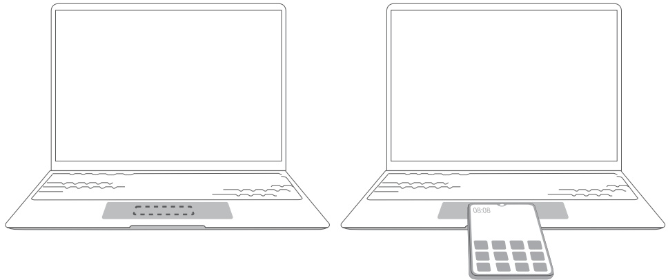</td></tr><tr><td>6</td><td>USB-C 接口</td></tr><tr><td>7</td><td>．连接电源适配器给计算机充电。 ·通过扩展坞，连接显示器、投影仪等视频显示设备。 ·连接手机、U盘等外接设备传输数据。 耳机接口</td></tr><tr><td>8</td><td>连接耳机。 HDMI接口</td></tr><tr><td>9</td><td>高清晰度多媒体接口，连接显示设备。 充电指示灯 充电时，显示电池充电状态：</td></tr><tr><td colspan="1" rowspan="1">10</td><td colspan="1" rowspan="1">Mini RJ45 接口连接 HUAWEI Mini RJ45 转 RJ45 转接线。i     仅部分机型配置此接口，请以实际为准。</td></tr><tr><td colspan="1" rowspan="1">11</td><td colspan="1" rowspan="1">USB-A (USB 3.2 Gen 1) 接口连接手机、U盘等外接设备传输数据。</td></tr><tr><td colspan="1" rowspan="1">12</td><td colspan="1" rowspan="1">摄像头排水孔键盘上的摄像头按钮与后壳排水孔相通，当有少量液体不小心从隐藏式摄像头进入键盘时，可从排水孔导出。但液体浸入键盘，可能会损坏您的计算机。</td></tr><tr><td colspan="1" rowspan="1">13</td><td colspan="1" rowspan="1">扬声器声音从扬声器中发出。</td></tr><tr><td colspan="1" rowspan="1">14</td><td colspan="1" rowspan="1">麦克风使用麦克风进行视频会议、语音通话或录音。</td></tr></table>

## 键盘

不同机型，键盘按键不同，请以实际为准。

## 快捷键功能介绍

计算机键盘的 F1、F2 等键默认为快捷键（热键）模式，可用于轻松执行常见任务。

<table><tr><td colspan="3" rowspan="1">F1</td><td colspan="1" rowspan="1">降低屏幕亮度</td></tr><tr><td colspan="1" rowspan="1"></td><td colspan="1" rowspan="1">F2</td><td colspan="1" rowspan="1"></td><td colspan="1" rowspan="1">增强屏幕亮度</td></tr><tr><td colspan="1" rowspan="1"></td><td colspan="1" rowspan="1">业F3</td><td colspan="1" rowspan="1"></td><td colspan="1" rowspan="1">开启或关闭键盘背光，调节键盘背光亮度i   如果此按键上无图标，则不支持背光。</td></tr><tr><td colspan="1" rowspan="1"></td><td colspan="1" rowspan="1">×F4</td><td colspan="1" rowspan="1"></td><td colspan="1" rowspan="1">开启或关闭静音</td></tr><tr><td colspan="1" rowspan="1"></td><td colspan="1" rowspan="1">小F5</td><td colspan="1" rowspan="1"></td><td colspan="1" rowspan="1">減小音量</td></tr><tr><td colspan="1" rowspan="1"></td><td colspan="1" rowspan="1">F6</td><td colspan="1" rowspan="1"></td><td colspan="1" rowspan="1">增大音量</td></tr><tr><td colspan="1" rowspan="1"></td><td colspan="1" rowspan="1">(F7</td><td colspan="1" rowspan="1"></td><td colspan="1" rowspan="1">开启或关闭麦克风</td></tr><tr><td colspan="3" rowspan="1">I0IF8</td><td colspan="1" rowspan="1">切换屏幕投影模式</td></tr><tr><td colspan="3">公 F9</td><td>开启或关闭无线网络</td></tr><tr><td colspan="3">IMI F10</td><td>开启华为电脑管家</td></tr></table>

## 快捷键与功能键切换

在功能键模式下，运行不同的软件时，F1、F2 等键被定义不同的功能。

若要将 F1、F2 等键作为功能键使用，您可以：

• 按下 Fn 键，当 Fn 键指示灯亮起，表示已将 F1、F2 等键锁定为功能键模式。只需再次按 Fn键，当 Fn 键指示灯熄灭，即可返回快捷键（热键）模式。

• 前往华为电脑管家的设置中心，在系统设置中，将键盘设置为功能键优先，设置后，F1、F2 等键将默认作为功能键使用。若要切换回快捷键模式，将键盘设置为热键优先即可。

## 触摸板

键盘上的触摸板拥有类似鼠标的功能，让您更方便的操控计算机。

并非所有手势都可用于所有应用，请以实际为准。

常见触摸板手势

<table><tr><td colspan="2">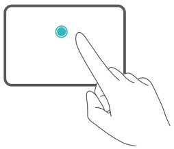</td><td>单指点击：相当于单击鼠标左键</td></tr><tr><td colspan="2">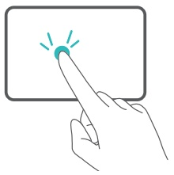</td><td>单指双击：相当于双击鼠标左键</td></tr><tr><td colspan="2">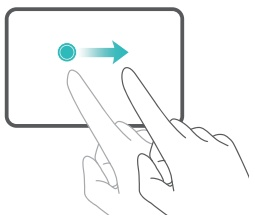</td><td>单指移动：移动桌面上的光标</td></tr><tr><td colspan="2">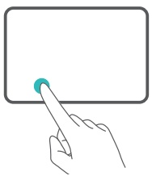</td><td>左键单击：相当于单击鼠标左键</td></tr><tr><td colspan="2" rowspan="1">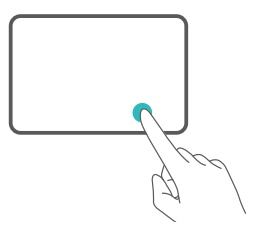</td><td colspan="1" rowspan="1">右键单击：相当于单击鼠标右键</td></tr><tr><td colspan="2" rowspan="1">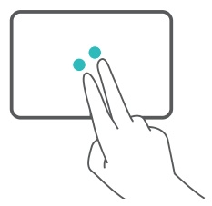</td><td colspan="1" rowspan="1">双指点击：相当于单击鼠标右键</td></tr><tr><td colspan="1" rowspan="1"></td><td colspan="1" rowspan="1">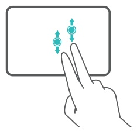</td><td colspan="1" rowspan="1">双指上下滑动：滚动浏览屏幕或文档</td></tr><tr><td colspan="2" rowspan="1">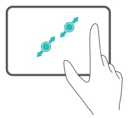</td><td colspan="1" rowspan="1">双指张开或闭合：浏览图片、网页等时，可以放大或缩小图片、网页等</td></tr><tr><td colspan="2" rowspan="1">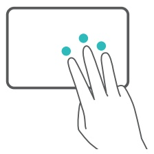</td><td colspan="1" rowspan="1">三指点击：使用搜索</td></tr><tr><td colspan="2" rowspan="1">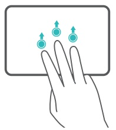</td><td colspan="1" rowspan="1">三指向上滑动：多任务视图</td></tr><tr><td colspan="2" rowspan="1">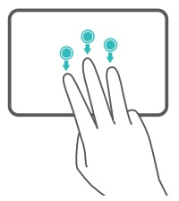</td><td colspan="1" rowspan="1">三指向下滑动：显示桌面</td></tr><tr><td colspan="2" rowspan="1">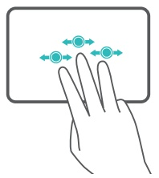</td><td colspan="1" rowspan="1">三指左右滑动：切换应用</td></tr></table>

/422259c7f1807eefd780038b9da0f1a9cdf0635e8dfae5656064847e056fb688.jpg)

四指点击：快速打开通知中心和日历

## 更改触摸板设置

您也可以根据自己的使用习惯更改触摸板设置，让指尖操作更得心应手。

1 点击 > 打开设置界面。

2 在设置界面中，点击 ,再点击 ，您可以：

• 开启或关闭触摸板。

• 连接鼠标时开启或关闭触摸板。

• 更改触摸滚动方向。

• 设置手指动作在触摸板上的功能等。

## 给计算机充电

当电池电量过低时，计算机会弹出低电提示，请及时为计算机充电，以免影响到您的使用。

## 使用电源适配器为计算机充电

计算机内置（不可拆卸）可充电电池。连接电源适配器和充电线缆可对计算机充电。计算机处于关机或睡眠状态时，充电速度更快。

/f9ee8ca54c9831acacfabc440dd1f3a18ba534e282ca83b8e9c0f04f815e2e48.jpg)

## 充电注意事项

• 请在适宜的温度范围内和通风良好的阴凉区域为计算机充电，在高温环境下充电可能会损坏计算机。

• 计算机充电时间会随温度条件和电池使用状况而变化。

• 计算机长时间工作和充电时，可能会表面发热，这属于正常现象。感觉发烫时，请关闭部分功能并停止充电。

• 电池属于易损耗品，如发现电池使用寿命大幅度减少，请勿自行更换，请前往附近的华为客户服务中心更换原装电池。

## 了解电池状态

您可以通过桌面右下角的电池图标判断当前的电池状态：

：表示计算机已连接电源，点击 > > > 电源和电池选项，可查看电量充满时间。

：表示计算机未连接电源，点击 > > > 电源和电池选项，可查看电池的剩余电量和剩余使用时间。

电池图标显示的电量充满时间和电池剩余使用时间是操作系统估算的时间，非实际时间。

## 启用计算机

## 开启和关闭计算机

首次开机时，必须连接电源适配器，计算机自动开机。等待屏幕亮起后，进入开机设置界面。

计算机关机或睡眠时，短按电源键至屏幕或键盘指示灯亮起，即可开启或唤醒计算机。

计算机正常使用时，点击 > ，使计算机进入睡眠、关机或重启的状态。

强制关机：长按电源键 10 秒以上，可强制关机。强制关机会导致未保存的数据丢失，请谨慎使用。

## 获取精彩功能

请点击桌面底部任务栏上的 华为电脑管家 > 玩机技巧，获取更多精彩功能。

## F10 一键恢复出厂

计算机内置的 F10 系统恢复出厂功能，能短时间内帮您将计算机系统恢复到初始状态。

系统恢复出厂会删除 C 盘中数据（也包含桌面文件、下载、文档等个人数据），请您备份 C盘内的个人数据。

1 将计算机连接电源，开机过程中连续快速点按 F10 键。

2 进入界面后，根据界面提示进行恢复出厂。

/4a4c756593c2620efbcbb44d71b478b972a9a8bcd1814c3b923803df0ee651f3.jpg)

## 护眼模式

长期阅读时，建议您开启计算机护眼模式。

右键点击桌面空白处，点击 显示更多选项 > 显示管理，点击开启护眼模式开关。

开启护眼模式后，屏幕显示偏黄为正常现象。

/6e4603754b7349c838cf8d8130e0ea257cd923840837196c00ce1982b477275c.jpg)

# 配件及扩展连线

## 扩展坞（可选配件）

通过扩展坞接口或插槽，计算机可以连接兼容多种设备和配件，如投影仪、电视、U 盘等，满足您的扩展需求。

扩展坞为可选配件，您可单独购买。

了解 HUAWEI MateDock 2 扩展坞

/b59d98f4de1a34605ffb49473f3aca07b8907a8aeeb9e0e299e4b57ea3f2c228.jpg)

<table><tr><td rowspan=1 colspan=1>USB-C 插头</td><td rowspan=1 colspan=1>连接计算机 USB-C 接口。</td></tr><tr><td rowspan=1 colspan=1>USB-A 接口</td><td rowspan=1 colspan=1>连接USB 设备，如 USB 鼠标/键盘、USB 存储设备、USB 网卡等。</td></tr><tr><td rowspan=1 colspan=1>HDMI接口</td><td rowspan=1 colspan=1>连接HDMI 输入设备，如电视机。</td></tr><tr><td rowspan=1 colspan=1>VGA 接口</td><td rowspan=1 colspan=1>连接VGA 输入设备，如显示器。</td></tr><tr><td rowspan=1 colspan=1>USB-C 接口</td><td rowspan=1 colspan=1>连接USB-C 接口设备。</td></tr></table>

/e04c4c868cea58735885e66691159da1ae18c448eef58ae2523d5e64c12c5c6c.jpg)

<table><tr><td rowspan=1 colspan=1>USB-C 插头</td><td rowspan=1 colspan=1>连接计算机 USB-C 接口。</td></tr><tr><td rowspan=1 colspan=1>microSD 卡槽</td><td rowspan=1 colspan=1>支持 4K Class10 高速 TF 卡数据传输。</td></tr><tr><td rowspan=1 colspan=1>USB-A 接口 x 2</td><td rowspan=1 colspan=1>连接USB 设备，如USB 鼠标/键盘、USB 存储设备、USB 网卡等。</td></tr><tr><td rowspan=1 colspan=1>USB-C 充电接口</td><td rowspan=1 colspan=1>连接USB-C接口设备充电，不支持数据传输。</td></tr><tr><td rowspan=1 colspan=1>VGA接口</td><td rowspan=1 colspan=1>连接VGA 输入设备，如显示器。</td></tr><tr><td rowspan=1 colspan=1>HDMI接口</td><td rowspan=1 colspan=1>连接HDMI输入设备，如电视机。</td></tr><tr><td rowspan=1 colspan=1>LAN 接口</td><td rowspan=1 colspan=1>连接网线。</td></tr></table>

## 连接到电视、显示器或投影仪

观看电影或会议演示时，将计算机连接到电视、显示器或投影仪等大屏显示设备，观看效果更佳。

• 除了计算机、扩展坞和连接设备之外，您还需要准备 HDMI 或 VGA 连接线缆。

• 在连接之前您需要检查所连接设备的端口。

• 通过扩展坞将计算机连接到电视等设备的操作步骤类似，下文以 HUAWEI MateDock 2扩展坞为例。

• HDMI 接口和 VGA 接口不能同时使用。

/76bd73cd6cff429263053a4b2b532339be1f5c5ffff6ab48eea1378167aed95f.jpg)

1 参照图示，通过扩展坞连接计算机和电视、显示器或投影仪。

2 接通电视、显示器或投影仪的电源并打开。

/7bba580cfaee81ffc400df9388f3bc342874f1c0ebada7ea1118b359dd9609c0.jpg)

3 热键模式下，按 F8 键，或者点击 + P 打开投影界面，选择投影方式。

• ，只在计算机显示桌面，外接设备屏幕不显示内容。

• ，在计算机和外接设备上都显示桌面。

• ，将计算机的桌面扩展到外接设备屏幕，可以在屏幕之间移动项目。

• ，只在外接设备上显示桌面，计算机屏幕不显示内容。

## 连接 USB 鼠标、打印机或其他设备

通过扩展坞 USB-A 接口，可连接 USB 鼠标、打印机、扫描仪、智能手机或硬盘等 USB 设备。

连接 USB 设备

1 将设备的 USB 线缆插入扩展坞 USB-A 接口。

2 如果设备需要连接电源线，请接通设备电源并启动 USB 设备。

3 首次安装 USB 设备时，计算机会自动安装设备所需的软件。

查找计算机安装的 USB 设备

1 点击桌面底部任务栏的 ，打开文件管理器。

2 点击 此电脑，可查看安装的 USB 设备。

## 蓝牙鼠标（可选配件）

华为蓝牙鼠标可通过蓝牙连接计算机。首次使用蓝牙鼠标，需要完成蓝牙鼠标与计算机的配对。

了解蓝牙鼠标

蓝牙鼠标为可选配件，您可单独购买。

/19a8618c30bafab7591f3744a6c94bd0c9a5e53b511305f382a30d19d8b5675a.jpg)

/f35dbca63cb1660a74a47b24bc1f4f6db8eba53779544174bf2a10a6b60fac16.jpg)

<table><tr><td rowspan=1 colspan=1>1</td><td rowspan=1 colspan=1>左键</td><td rowspan=1 colspan=1>2</td><td rowspan=1 colspan=1>滚轮+中键</td></tr><tr><td rowspan=1 colspan=1>3</td><td rowspan=1 colspan=1>右键</td><td rowspan=1 colspan=1>4</td><td rowspan=1 colspan=1>LED 指示灯i  指示灯为红色闪烁时，表示电池电量低，请注意更换电池。</td></tr><tr><td rowspan=1 colspan=1>5</td><td rowspan=1 colspan=1>传感器</td><td rowspan=1 colspan=1>6</td><td rowspan=1 colspan=1>电源/蓝牙配对开关</td></tr></table>

## 安装电池

如下图所示，沿鼠标尾部标志打开上壳，按电池仓正负极(＋－)的标志安装一节 AA 电池，合上上壳，即可安装完成。

/c0004ee958000181feb7ef39b6fabe3978b54310d8b41c9e58ae1b3cb97c10fe.jpg)

蓝牙鼠标与计算机配对

/f66d2530493244fcf83696d554c2b802ea9e4b634d36f4c14ab5f87ddcfefe82.jpg)

1 按照图示将蓝牙鼠标底部开关拨至 处并保持 3 秒，指示灯闪烁后松开，鼠标进入配对状态。

2 在计算机中，点击 > > ，进入蓝牙和其他设备界面，点击 添加蓝牙设备，在发现的蓝牙设备列表中选择 Huawei Mouse，稍等即可完成配对。

## HUAWEI Mini RJ45 转 RJ45 转接线（部分机型配置）

部分国家或地区的某些机型配置有 HUAWEI Mini RJ45 转 RJ45 转接线，请以实际为准。

通过 HUAWEI Mini RJ45 转 RJ45 转接线，把您的计算机连接到有线网络。 RJ45 接口连接网线，迷你 RJ45 接口连接计算机。

/691128964b9f3f1246378c28941e2ab3a79ee2d3c1b369c8944d8f008aeb00be.jpg)

/93b83df41015deeb1552b5361de65782078b8b585ff14c52f508538f05eb4719.jpg)

RJ45  
/cdbf6d26257fa52677c0130202e846c4c6d93fcd5cfd11f84e4a8eb0628ec52c.jpg)

## 安全信息

【警告】在使用和操作设备前，为确保设备性能最佳，并避免出现危险或非法情况，请查阅并遵循所有的安全信息。

## 电子设备

有明文规定禁止使用无线设备的场所，请勿使用本设备，否则会干扰其它电子设备或导致其它危险。

## 对医疗设备的影响

• 在明文规定禁止使用无线设备的医疗和保健场所，请遵守该场所的规定，并关闭设备。

• 设备产生的无线电波或含有磁铁可能会影响植入式医疗设备或个人医用设备的正常工作，如起搏器、植入耳蜗、助听器等。若您使用了这些医用设备，请向其制造商咨询使用本设备的限制条件。

• 在使用本设备时，请与植入的医疗设备（如起搏器、植入耳蜗等）保持至少 15 厘米的距离。

## 听力保护

• 当您使用耳机收听音乐或通话时，建议使用音乐或通话所需的最小音量，以免损伤听力。长时间接触高音量可能会导致永久性听力损伤。

• 驾车时接触高音量可能会分散注意力，从而导致事故。

## 易燃易爆区域

• 在加油站（维修站）或靠近易燃物品、化学制剂等任何易燃易爆区域，请勿使用本设备，并遵守所有图形或文字的指示。在燃油或化学制剂存放和运输区或易爆场所内或周围，设备可能引起爆炸或起火。

• 请勿将设备及其配件与易燃液体、气体或易爆物品放在同一箱子中存放或运输。

## 交通安全

• 遵守所在地区或国家的相关规定，驾车时请勿使用本设备。

• 谨记安全驾驶是您的首要职责，请勿从事会分散注意力的活动。

• 汽车的电子设备可能因设备的无线电干扰而出现故障。请联系制造商咨询详细信息。

• 请勿将设备放在汽车安全气囊上方或安全气囊展开后能够触及的区域内。否则当安全气囊膨胀时，设备就会受到很强的外力推动而对车内人员造成严重伤害。

• 无线设备可能干扰飞机的飞行系统，请遵守航空公司的相关规定，在禁止使用无线设备的地方，请勿使用该设备。

## 操作环境

• 请勿在多灰、潮湿、肮脏或靠近磁场的地方使用设备，以免引起设备内部电路故障。

• 请勿在雷雨天气使用本设备。雷雨天气可能导致设备故障或电击危险。

• 请在温度 0℃～35℃ 范围内使用本设备，并在温度 -10℃～+45℃ 范围内存放设备及其配件。当环境温度过高或过低时，可能会引起设备故障。

• 请勿将设备放置在阳光直射的地方，如汽车仪表盘或窗台处。

• 请避免设备及其配件雨淋或受潮，否则可能导致火灾或触电危险。

• 请勿将设备靠近热源或裸露的火源，如电暖器、微波炉、烤箱、热水器、炉火、蜡烛或其他可能产生高温的地方。

• 设备在运行一段时间后，设备温度会升高。如果设备温度过高，请勿长时间接触，否则可能导致低温烫伤，引起皮肤红肿或色素沉淀。

• 请勿让儿童或宠物吞咬设备或其配件，以免对其造成伤害或导致设备故障或爆炸。

• 当不断重复同一动作时（例如玩游戏），您的手、臂、腕、肩、颈或其他身体部位可能会偶尔感觉不适。如果您感觉到不适，请停止使用并咨询医师。

## 儿童健康

• 本设备及其配件可能包含一些小零件，请将设备及其配件放置在儿童接触不到的地方。儿童可能在无意之中损坏本设备及其配件，或吞下小零件导致窒息或其他危险。

• 本设备并非玩具，儿童应在成人监护下使用设备。

## 配件要求

• 使用未经认可或不兼容的电源、充电器或电池，可能引发火灾、爆炸或其他危险。

• 只能使用设备制造商认可且与此型号设备配套的配件。如果使用其他类型的配件，可能违反本设备的保修条款以及本设备所处国家的相关规定，并可能导致安全事故。如需获取认可的配件，请与华为客户服务中心联系。

## 充电器安全

• 电源插头作为断开装置，对可插式设备，电源插座应安装在产品附近并应易于操作。

• 当长时间不使用设备时，请断开电源适配器与设备的连接，并从电源插座上拔掉电源适配器；若需长期存放设备，请将设备关机并置于阴凉干燥的环境中 (理想温度为 20℃～25℃)，并将设备电量维持在 50% 左右，并每隔六个月将设备电量复充至 50%。

• 请勿摔落或碰撞充电器。充电器外壳受损时请联系华为客户服务中心进行更换。

• 若充电器插头、外壳或电源线已损坏，请勿继续使用，以免发生触电或火灾。

• 请勿用湿手触碰电源线，或用拉电源线缆的方式拔出充电器。

• 请勿用湿手触摸设备或充电器，以免发生设备短路、故障或触电。

• 若设备需要连接 USB 端口，请确认 USB 端口具备 USB-IF 标识且其性能符合 USB-IF 的相关规范。

## 电池安全

• 如果更换不正确的型号的电池会有起火或爆炸的危险。

• 请勿将电池暴露在高温处或发热产品的周围，如日照、取暖器、微波炉、烤箱或热水器等。电池过热可能引起爆炸。

• 请勿将电池放置在极低气压环境中，可能导致电池爆炸或泄漏可燃液体或气体。

• 请勿把电池扔到火里，否则会导致电池起火和爆炸。

• 请勿跌落、挤压或穿刺电池。避免让电池遭受外部大的压力，从而导致电池内部短路和过热。

• 请勿拆解或改装电池、插入异物、或浸入水中或其他液体中，以免引起电池漏液、过热、起火或爆炸。

• 请按当地规定处理电池，不可将电池作为生活垃圾处理。若电池处置不当可能会导致电池爆炸。

• 当设备的电池使用寿命明显下降时，请更换电池。

• 本设备采用不可拆卸的内置电池，切勿自行更换电池，以免导致设备无法正常运行或电池损坏。为了您的人身安全和保障产品正常运作，强烈建议您到华为客户服务中心更换本设备电池。

## 维护和保养

• 请保持设备及其配件干燥。请勿使用微波炉或吹风机等外部加热设备对其进行干燥处理。

• 请勿在温度过高或过低区域放置设备及其配件，否则可能导致设备故障、着火或爆炸。

• 请勿使设备及其配件受到强烈的冲击或震动，以免损坏设备及其配件，导致设备故障。

• 清洁和维护前，请停止使用本设备，关闭所有应用，并断开与其他设备的所有连接或线缆。

• 请勿使用烈性化学制品、清洗剂或强洗涤剂清洁设备或其配件。请使用清洁、干燥的软布擦拭设备或其配件。

• 请勿将磁条卡（例如银行卡、电话卡等）长期接触本设备，否则可能导致磁条卡被磁场损坏。

• 请勿擅自拆卸或改装设备及配件，否则该设备及配件将不在本公司保修范围之内，设备发生故障时请联系华为客户服务中心。

• 如果设备碰撞硬物或设备受到外界的强烈撞击造成破碎，切勿触摸或试图移除破碎的部分，请立即停止使用并及时联系华为客户服务中心。

## 环境保护

• 请勿将本设备及其附件作为普通的生活垃圾处理。

• 请遵守本设备及其附件处理的本地法令，并支持回收行动。

## 认证信息

请在产品铭牌上查看型号核准代码。

## 支持微功率短距离无线电发射能力说明（NFC）

本产品具备《中华人民共和国无线电管理条例》规定的微功率短距离无线电发射能力（NFC 功能），根据“工业和信息化部公告 2019 年第 52 号”的要求，现注明如下：

（一）产品符合“微功率短距离无线电发射设备目录和技术要求”第一条通用微功率设备第 3 款 C类设备的规定，内置环形 NFC 天线，通过负载调制方式实现一碰连通信，不具备主动发射场景，用户可根据产品说明书来使用此功能；

（二）不得擅自改变使用场景或使用条件、扩大发射频率范围、加大发射功率（包括额外加装射频功率放大器），不得擅自更改发射天线；

（三）不得对其他合法的无线电台（站）产生有害干扰，也不得提出免受有害干扰保护；

（四）应当承受辐射射频能量的工业、科学及医疗（ISM）应用设备的干扰或其他合法的无线电台（站）干扰；

（五）如对其他合法的无线电台（站）产生有害干扰时，应立即停止使用，并采取措施消除干扰后方可继续使用；

（六）在航空器内和依据法律法规、国家有关规定、标准划设的射电天文台、气象雷达站、卫星地球站（含测控、测距、接收、导航站）等军民用无线电台（站）、机场等的电磁环境保护区域内使用微功率设备，应当遵守电磁环境保护及相关行业主管部门的规定；

（七）禁止在以机场跑道中心点为圆心、半径 5000 米的区域内使用各类模型遥控器；

（八）本产品 NFC 工作电压为 3.3V，工作环境温度为 $0 ^ { \circ } C \sim 3 5 ^ { \circ } C$

（九）使用微功率短距离无线电发射设备应当符合国家无线电管理有关规定。

## 个人信息和数据安全

在使用设备的一些功能和第三方应用时，可能会因为操作不正确或其他原因导致您的个人信息或数据泄露或丢失，建议按以下方式加强保护您的个人信息。

• 请将设备放置于安全区域，防止未经授权人员使用您的设备。

• 设置设备屏幕锁定，并牢记您设定的密码或解锁图案。

• 建议不要阅读来自陌生人的信息或邮件，以免设备遭受病毒感染。

• 在使用设备上网时，请勿浏览存在安全隐患的网站，以免个人信息被盗。

• 在使用无线共享、蓝牙等业务时，请设定密码，防止未授权访问。不需要使用这些业务时，建议及时关闭。

• 安装设备安全软件，并定期进行安全检查。

• 获取第三方应用时，应保证获取方式的安全性。获取的第三方应用程序应进行病毒扫描。

• 请及时安装或升级华为或授权的第三方应用程序供应商发布的安全性软件或补丁。

• 使用非授权第三方软件升级设备的固件和系统，可能存在设备无法使用或者泄漏您个人信息等安全风险。建议您使用在线升级或者将设备送至您附近的华为客户服务中心升级。

• 如果您使用了需要定位信息的应用程序，这些应用程序可以传输定位信息，第三方可能会共享这些定位信息。

• 设备可能会将检测、诊断等信息反馈给第三方应用程序供应商，这些信息将用于帮助第三方应用供应商改善产品和服务。

## 法律声明

版权所有 © 2024 华为终端有限公司。保留一切权利。

本手册描述的产品中，可能包含华为及其可能存在的许可人享有版权的软件。除非获得相关权利人的许可，否则，任何人不能以任何形式对前述软件进行复制、分发、修改、摘录、反编译、反汇编、解密、反向工程、出租、转让、分许可等侵犯软件版权的行为，但是适用法律禁止此类限制的除外。

## 商标声明

® 字标及其徽标均为  的注册商标，华为技术有限公司对此标记的任何使用都受到许可证限制，华为终端有限公司为华为技术有限公司的关联公司。

/1b87d71274f33dcc87eb1ff45325fc133e2d743c4b201ee8a290a7f8d359a8e6.jpg)

HDMI、HDMI High-Definition Multimedia Interface等词汇、HDMI 商业外观及HDMI 标识均为 HDMI Licensing Administrator, Inc. 的商标或注册商标。

Microsoft 和 Windows 是 Microsoft 集团公司的商标。

在本手册以及本手册描述的产品中，出现的其他商标、产品名称、服务名称以及公司名称，由其各自的所有人拥有。

## 注意

本手册描述的产品及其附件的某些特性和功能，取决于当地网络的设计和性能，以及您安装的软件。某些特性和功能可能由于当地网络运营商或网络服务供应商不支持，或者由于当地网络的设置，或者您安装的软件不支持而无法实现。因此，本手册中的描述可能与您购买的产品或其附件并非完全一一对应。

华为保留随时修改本手册中任何信息的权利，无需提前通知且不承担任何责任。

## 第三方软件声明

随本产品提供的第三方软件和应用程序归第三方所有，华为不拥有这些第三方软件和应用程序的知识产权，因此华为不对这些第三方软件和应用程序提供任何保证，华为既不会就这些软件和应用程序向您提供支持，也不对这些软件和应用程序的功能是否正常承担任何责任。

第三方软件和应用程序的服务可能中断或终止，华为不保证任何内容或服务可在任何期间维持其可用性。第三方系通过华为可控制范围外的网络及传输工具传送内容或服务。在相关法律允许的范围内，华为明确表示不对任何通过本产品提供的任何内容或服务的中断或终止承担任何责任。

对于您个人安装在本产品上的任何软件或上传、下载的任何文字、图片、视频或软件等第三方作品，华为不对其合法性、质量以及其他任何方面承担任何责任，对于您因个人安装软件或上传、下载前述第三方作品产生的任何后果，包括安装的软件与本产品不兼容等情况，由您自行承担一切相关风险。

## 责任限制

本手册中的内容均“按照现状”提供，除非适用法律要求，华为对本手册中的所有内容不提供任何明示或暗示的保证，包括但不限于适销性或者适用于某一特定目的的保证。

在适用法律允许的范围内，华为在任何情况下，都不对因使用本手册相关内容及本手册描述的产品而产生的任何特殊的、附带的、间接的、继发性的损害进行赔偿，也不对任何利润、数据、商誉或预期节约的损失进行赔偿。

在相关法律允许的范围内，在任何情况下，华为对您因为使用本手册描述的产品而遭受的损失的最大责任（除在涉及人身伤害的情况中根据适用的法律规定的损害赔偿外）以您购买本产品所支付的价款为限。

## 进出口管制

若需将本手册描述的产品（包括但不限于产品中的软件及技术数据等）出口、再出口或者进口，您应遵守适用的进出口管制法律法规。

## 隐私保护

为了解我们如何保护您的个人信息，请访问 https://consumer.huawei.com/privacy-policy 阅读我们的隐私政策。

本指南仅供参考，不构成任何形式的承诺，产品（包括但不限于颜色、大小、屏幕显示等）请以实物为准。如出现本指南与官网描述不一致的情况，请以官网说明为准，恕不另行通知。

## 获取更多

购买华为终端产品，请访问华为商城 https://www.vmall.com/更多信息请访问 https://consumer.huawei.com/cn/